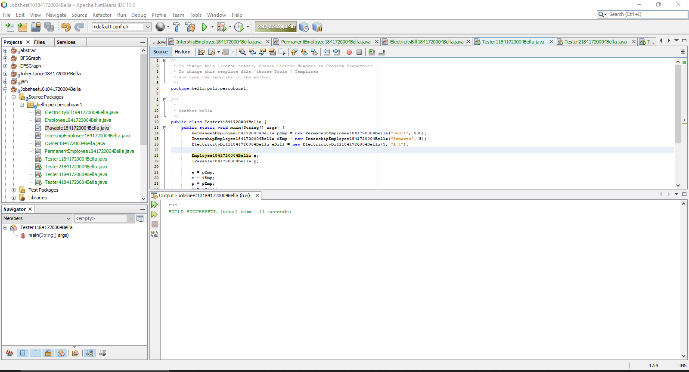
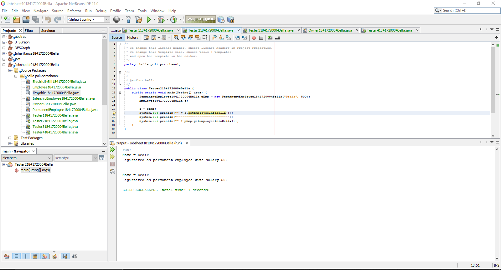
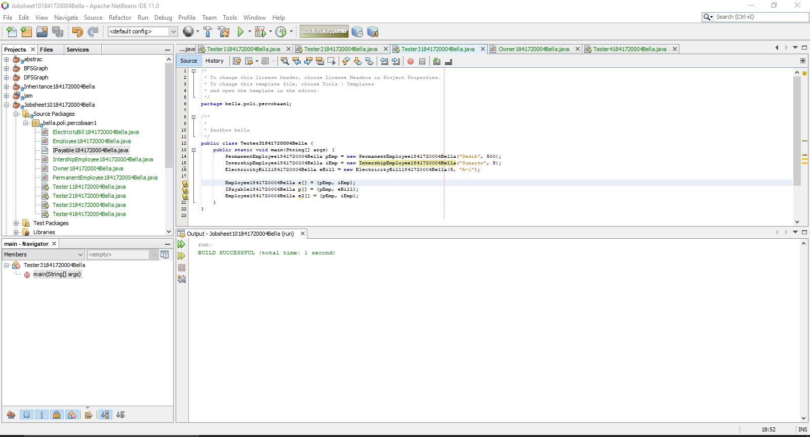
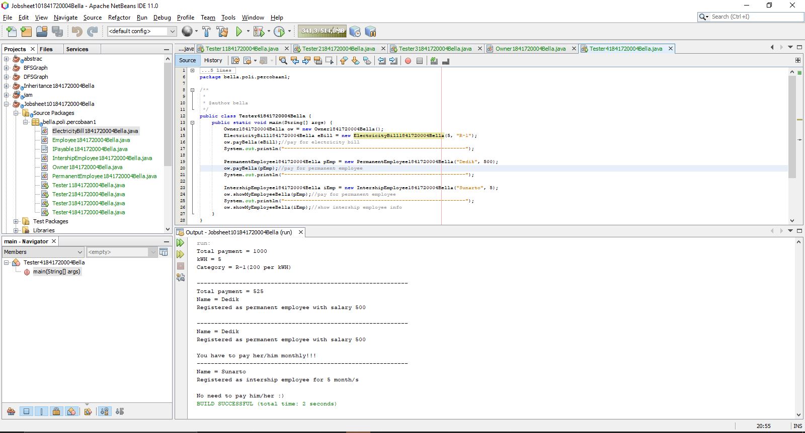
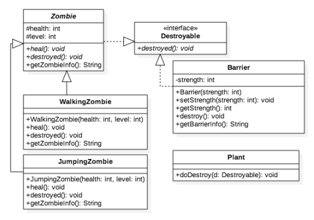
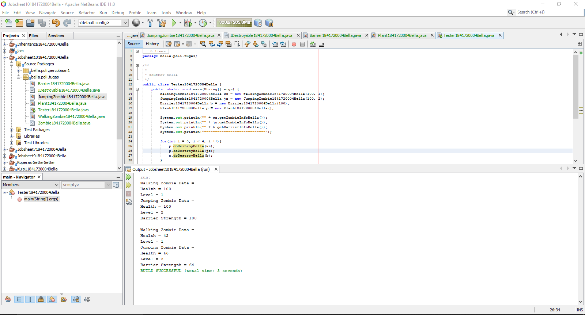

# Laporan Praktikum #10 - Polimorfisme

## Kompetensi
Setelah melakukan percobaan pada jobsheet ini, diharapkan mahasiswa
mampu:
1. Memahami konsep dan bentuk dasar polimorfisme
2. Memahami konsep virtual method invication
3. Menerapkan polimorfisme pada pembuatan heterogeneous collection
4. Menerapkan polimorfisme pada parameter/argument method
5. Menerapkan object casting untuk meng-ubah bentuk objek

## Ringkasan Materi
Polimorfisme merupakan kemampuan suatu objek untuk memiliki banyak bentuk. Konsep polimorfisme bisa diterapkan pada class-class yang memiliki relasi inheritance (relasi generalisasi atau IS-A), polimorfisme juga bisa diterapkan pada interface.

Virtual method invocation terjadi ketika ada pemanggilan overriding method dari suatu objek polimorfisme. Disebut virtual karena antara method yang dikenali oleh compiler dan method yang dijalankan oleh JVM berbeda.

Heterogeneous collection dalam polimorfisme di dalam array bisa diisi dengan berbagai macam objek yang berbeda.

Polimorfisme juga bisa diterapkan pada argument suatu method. Tujuannya agar method tersebut bisa menerima nilai argument dari berbagai bentuk objek.

Casting objek digunakan untuk mengubah tipe dari suatu objek. Jika ada suatu objek dari subclass kemudian tipenya diubah ke superclass, maka hal ini termasuk ke upcasting. Downcast terjadi jika ada suatu objek superclass, kemudian diubah menjadi objek dari subclass. Proses downcasting sering disebut juga sebagai explicit casting

## Percobaan
### Percobaan 1 - Bentuk dasar polimorfisme
Pada percobaan ini kita akan membuat sebuah class Employee1841720004Bella (parent), IntershipEmployee1841720004Bella (child 1), PermanentEmployee184172004Bella(child 2), IPayable1841720004Bella (interface), ElectricityBill1841720004Bella dan juga class main bernama Tester11841720004Bella. Berikut adalah hasil program praktikum 1:

Link: [Employee1841720004Bella.java](../../src/10_Polimorfisme/Employee1841720004Bella.java)

Link: [IntershipEmployee1841720004Bella.java](../../src/10_Polimorfisme/IntershipEmployee1841720004Bella.java)

Link: [PermanentEmployee1841720004Bella.java](../../src/10_Polimorfisme/PermanentEmployee1841720004Bella.java)

Link: [IPayable1841720004Bella.java](../../src/10_Polimorfisme/IPayable1841720004Bella.java)

Link: [ElectricityBill1841720004Bella.java](../../src/10_Polimorfisme/ElectricityBill1841720004Bella.java)

Link: [Tester11841720004Bella.java](../../src/10_Polimorfisme/Tester11841720004Bella.java)

### Percobaan 2 - Virtual method invocation

Pada percobaan ini, kita menambahkan class bernama Tester21841720004Bella. Berikut adalah hasil dari program Tester218417120004Bella:

Link: [Tester21841720004Bella.java](../../src/10_Polimorfisme/Tester21841720004Bella.java)

### Percobaan 3 – Heterogenous Collection

Pada percobaan ini, kita masih menggunakan class yang sudah dibuat sebelumnya. Dan kita menambahkan suatu class bernama Tester31841720004Bella. Berikut adalah hasil dari percobaan 3 setelah dibetulkan:

Link: [Tester31841720004Bella.java](../../src/10_Polimorfisme/Tester31841720004Bella.java)

Note: yang dibenarkan yaitu menghapus objek eBill di Employee18417200004Bella e2[]. Mengapa dihapus? Karena eBill bukan anak dari class Employee1841720004Bella, sehingga jika dibiarkan akan menimbulkan error.

### Percobaan 4 – Argumen polimorfisme, instanceod dan casting objek

Pada percobaan ini, kita masih menggunakan class yang sudah dibuat di atas dan kita hanya menambahkan class Owner1841720004Bella dan class Tester41841720004Bella. Berikut adalah hasil dari percobaan 4:

Link: [Owner1841720004Bella.java](../../src/10_Polimorfisme/Owner1841720004Bella.java)

Link: [Tester41841720004Bella.java](../../src/10_Polimorfisme/Tester41841720004Bella.java)

## Pertanyaan
1. Class apa sajakah yang merupakan turunan dari class **Employee1841720004Bella**? 

    **Jawaban:**

    Yang merupakan class turunan dari class Employee1841720004Bella adalah
    - Intershipemployee1841720004Bella
    - PermanentEmployee1841720004Bella

2. Class apa sajakah yang implements ke interface **IPayable1841720004Bella**?

    **Jawaban:**

    Class yang meng-implements ke interface yaitu:

    - ElectricityBill1841720004Bella.
    - PermanentEmployee1841720004Bella.

3. Perhatikan class **Tester11841720004Bella**, baris ke-10 dan 11. Mengapa e, bisa diisi dengan objek **pEmp** (merupakan objek dari class **PermanentEmployee1841720004Bella**) dan objek **iEmp** (merupakan objek dari class **InternshipEmploye1841720004Bella**) ?

    **Jawaban:**

    Karena class PermanentEmployee1841720004Bella dan class InternshipEmploye1841720004Bella merupakan turunan dari class Employee1841720004Bella atau sering disebut dengan proses Object Casting.

4. Perhatikan class **Tester11841720004Bella**, baris ke-12 dan 13. Mengapa **p**, bisa diisi
dengan objek **pEmp** (merupakan objek dari class **PermanentEmployee1841720004Bella**) dan objek **eBill** (merupakan objek dari class **ElectricityBill1841720004Bella**) ?

    **Jawaban:**

    Karena class PermanentEmployee1841720004Bella dan class ElectricityBill1841720004Bella meng-impliment ke class IPayable1841720004Bella, sehingga objek p bisa diisi dari objek kedua class tersebut.

5. Coba tambahkan sintaks:

    **p = iEmp;**

    **e = eBill;**

    pada baris 14 dan 15 (baris terakhir dalam method main) ! Apa yang menyebabkan error?

    **Jawaban:**

    Ya terjadi error. Yang menyebabkan yaitu class IntershipEmployee1841720004Bella tidak meng-implement class IPayable1841720004Bella dan class ElectricityBill1841720004Bella tidak meng-extends class Employee1841720004Bella.

6. Ambil kesimpulan tentang konsep/bentuk dasar polimorfisme!

    **Jawaban:**

    Polimorfisme bisa diterapkan pada class yang memiliki relasi inheritance dan juga interface. Dan pada polimorfisme ada juga yang disebut dengan Operator Instance of yang dimana digunakan untuk mengrcek apakah suatu object merupakan hasil instansiasi dari suatu class tertentu. Dan ada juga yang bernama Object Casting yang digunakan untuk mengubah tipe dari suatu objek.

7. Perhatikan class **Tester2** di atas, mengapa pemanggilan **e.getEmployeeInfoBella()** pada baris 8 dan **pEmp.getEmployeeInfoBella()** pada baris 10 menghasilkan hasil sama?

    **Jawaban:**

    Karena objek e diisi dengan objek pEmp, sehingga menghasilkan output yang sama.

8. Mengapa pemanggilan method **e.getEmployeeInfoBella()** disebut
sebagai pemanggilan method virtual (virtual method invication),
sedangkan **pEmp.getEmployeeInfoBella()** tidak?

    **Jawaban:**

    Karena ketika objek e memanggil method getEmployeeInfoBella(), e memanggil method overriding. Karena e sudah diisi dengan pEmp.

9. Jadi apakah yang dimaksud dari virtual method invocation? Mengapa disebut virtual?

    **Jawaban:**

    Virtual method invocation adalah suatu pemanggilan overriding method dari suatu objek polimorfisme, disebut virtual karena antara method yang dikenali oleh kompiler dan method yang dijalankan oleh JVM berbeda.

10. Perhatikan array e pada baris ke-8, mengapa ia bisa diisi dengan objek-objek dengan tipe yang berbeda, yaitu objek pEmp (objek dari **PermanentEmployee1841720004Bella**) dan objek **iEmp** (objek dari **InternshipEmployee1841720004Bella**) ?

    **Jawaban:**

    Karena objeck e merupakan deklarasi dari class Employee1841720004Bella yang dimana merupakan super class dari class PermanentEmployee1841720004Bella dan class InternshipEmployee1841720004Bella.

11. Perhatikan juga baris ke-9, mengapa array p juga diisi dengan objek-objek dengan tipe yang berbeda, yaitu objek **pEmp** (objek dari **PermanentEmployee1841720004Bella**) dan objek eBill (objek dari **ElectricityBill1841720004Bella**) ?

    **Jawaban:**

    Karena objek p merupakan deklarasi class IPayable1841720004Bella yang dimana class PermanentEmployee1841720004Bella dan class ElectricityBill1841720004Bella meng-implement class IPayable1841720004Bella.

12. Perhatikan baris ke-10, mengapa terjadi error?

    **Jawaban:**

    Terjadi error karena eBill (ElectricityBill1841720004Bella) bukan anak dari class Employee1841720004Bella, sehingga e2 tidak mau diisi dengan objek eBill.

13. Perhatikan class Tester41841720004Bella baris ke-7 dan baris ke-11, mengapa pemanggilan ow.payBella(eBill) dan ow.payBella(pEmp) bisa dilakukan, padahal jika diperhatikan method payBella() yang ada di dalam class Owner1841720004Bella memiliki argument/parameter bertipe 1841720004Bella? Jika diperhatikan lebih detil eBill merupakan objek dariElectricityBill1841720004Bella dan pEmp merupakan objek dari PermanentEmployee1841720004Bella?

    **Jawaban:**

    Karena di dalam method payBella() akan dicek apakah objek tersebut merupakan hasil instansiasi dari class yang sudah ditentukan. 

14. Jadi apakah tujuan membuat argument bertipe Payable1841720004Bella pada method payBella() yang ada di dalam class Owner1841720004Bella?

    **Jawaban:**

    Digunakan utuk membuat menge-check apakah object tersebut merupakan hasil dari instansiasi atau bukan dan mennjalankan isi nya yang berada di dalamnya.

15. Coba pada baris terakhir method main() yang ada di dalam class Tester41841720004Bella ditambahkan perintah ow.payBella(iEmp). Mengapa terjadi error?

    **Jawaban:**

    Terjadi error, karena IntershipEmployee1841720004Bella tidak mengimplements IPayable1841720004Bella.

16. Perhatikan class Owner1841720004Bella, diperlukan untuk apakah sintaks p instanceof ElectricityBill1841720004Bella pada baris ke-6 ?

    **Jawaban:**

    Digunakan untuk mengecek apakah p merupakan hasil instansiasi dari ElectricityBill1841720004Bella.

17. Perhatikan kembali class Owner1841720004Bella baris ke-7, untuk apakah casting objek disana (ElectricityBill1841720004Bella eb = (ElectricityBill1841720004Bella) p) diperlukan ? Mengapa objek p yang bertipe Payable1841720004Bella harus di-casting ke dalam objek eb yang bertipe ElectricityBill1841720004Bella ?

    **Jawaban:**

    Digunakan untuk menampilkan hasil / info tentang ElectricityBill1841720004Bella.

## Tugas
Dalam suatu permainan, Zombie dan Barrier bisa dihancurkan oleh Plant dan bisa menyembuhkan diri. Terdapat dua jenis Zombie, yaitu Walking Zombie dan Jumping Zombie. Kedua Zombie tersebut memiliki cara penyembuhan yang berbeda, demikian juga cara penghancurannya, yaitu ditentukan oleh aturan berikut ini:
- Pada WalkingZombie
1. Penyembuhan : Penyembuhan ditentukan berdasar level
zombie yang bersangkutan
- Jika zombie level 1, maka setiap kali penyembuhan,
health akan bertambah 20%
- Jika zombie level 2, maka setiap kali penyembuhan,
health akan bertambah 30%
- Jika zombie level 3, maka setiap kali penyembuhan,
health akan bertambah 40%
2. Penghancuran : setiap kali penghancuran, health akan berkurang 20%
- Pada Jumping Zombie
1. Penyembuhan : Penyembuhan ditentukan berdasar level zombie yang bersangkutan
- Jika zombie level 1, maka setiap kali penyembuhan,
health akan bertambah 30%
- Jika zombie level 2, maka setiap kali penyembuhan,
health akan bertambah 40%
- Jika zombie level 3, maka setiap kali penyembuhan,
health akan bertambah 50%
2. Penghancuran : setiap kali penghancuran, health akan berkurang 10%

Buat program dari class diagram di bawah ini!

Berikut adalah hasil dari program yang sudah di buat:

Link: [Zombie1841720004Bella.java](../../src/10_Polimorfisme/Zombie1841720004Bella.java)

Link: [WalkingZombie1841720004Bella.java](../../src/10_Polimorfisme/WalkingZombie1841720004Bella.java)

Link: [JumpingZombie1841720004Bella.java](../../src/10_Polimorfisme/JumpingZombie1841720004Bella.java)

Link: [Barrier1841720004Bella.java](../../src/10_Polimorfisme/Barrier1841720004Bella.java)

Link: [Plant1841720004Bella.java](../../src/10_Polimorfisme/Plant1841720004Bella.java)

Link: [Tester1841720004Bella.java](../../src/10_Polimorfisme/Tester1841720004Bella.java)

## Kesimpulan

Pada jobsheet kali ini, kita belajar mengenai polimorfisme. Yang dimana di dalamnya membahas tentang virtual method invocation, heterogeneous collection, polymorphic argumen, operator instanceof, object casting.

## Pernyataan Diri

Saya menyatakan isi tugas, kode program, dan laporan praktikum ini dibuat oleh saya sendiri. Saya tidak melakukan plagiasi, kecurangan, menyalin/menggandakan milik orang lain.

Jika saya melakukan plagiasi, kecurangan, atau melanggar hak kekayaan intelektual, saya siap untuk mendapat sanksi atau hukuman sesuai peraturan perundang-undangan yang berlaku.

Ttd,

_**(Bella Setyowati)**_