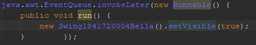
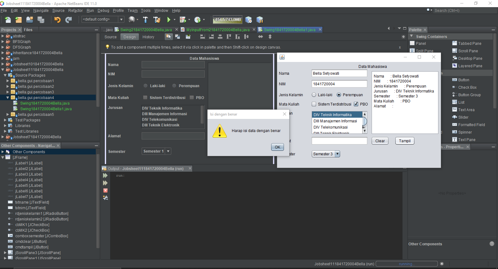

# Laporan Praktikum #11 - GUI

## Kompetensi
Setelah menyelesaikan lembar kerja ini mahasiswa diharapkan mampu:
1. Membuat aplikasi Graphical User Interface sederhana dengan bahasa pemrograman java;
2. Mengenal komponen GUI seperti frame, label, textfield, combobox, radiobutton, checkbox,
textarea, menu, serta table;
3. Menambahkan event handling pada aplikasi GUI.

## Ringkasan Materi
Hal yang harus dilakukan dalam pemrograman GUI:
1. Membuat windows utama.
2. Menentukan komponen-komponen pendukung program.
3. Menentukan tata letak layout agar nantinya semua komponen – komponen yang sudah dipersiapkan bisa diaatur sedemikian rupa.
4. Event Handling dari sebuah aktivitas, seperti penekanan button, check box dan lain-lain.

Java Swing merupakan turunan dari AWT, dan umumnya kelas-kelasnya yanng berada dalam kkomponen Swing diawali dengan huruf J, misal JButton dsb.

## Percobaan
### Percobaan 1 - JFrame HelloGUI
Pada percobaan ini, kita membuat sebuah class bernama HelloGui1841720004Bella, yang diamana di dalam program tersebut kita membuat sebuah frame. Berikut adalah hasil programnya:

Link : [HelloGui1841720004Bella.java](../../src/11_GUI/HelloGui1841720004Bella.java)

### Percobaan 2 - Menangani Input Pada GUI
Pada percobaan ini, kita membuat sebuah class bernama MyInputFrom1841720004Bella yang dimana kita sudah mulai belajar memanfaatkan komponen-komponen GUI pada java untuk menangani inputan. Berikut adalah hasil programnya:

Link : [MyInputFrom1841720004Bella.java](../../src/11_GUI/MyInputFrom1841720004Bella.java)

### Percobaan 3 - Manajemen Layout
Pada percobaan ini, kita belajar mengenai layout yang berada di Java GUI, yaitu:
1. Border layout
2. Grid layout
3. Box layout

Berikut adalaha hasil program saya: 

Link : [Border1841720004Bella.java](../../src/11_GUI/Border1841720004Bella.java)

Link : [Grid1841720004Bella.java](../../src/11_GUI/Grid1841720004Bella.java)

Link : [Box1841720004Bella.java](../../src/11_GUI/Box1841720004Bella.java)

Link : [LayoutGui1841720004Bella.java](../../src/11_GUI/LayoutGui1841720004Bella.java)

### Percobaan 4 - Membuat GUI Melalui IDE Netbeans
Pada percobaan ini, kita membuat sebuah class bernama Swing1841720004Bella yang dimana pada percobaan ini kita belajar mengenai komponen-komponen Java GUI yang dimana kita akan langsung drag and drop. Berikut adalah hasil percobaan 4 saya:

Link : [Swing1841720004Bella.java](../../src/11_GUI/Swing1841720004Bella.java)

Link : [Swing1841720004Bella.form](../../src/11_GUI/Swing1841720004Bella.form)

### Percobaan 5 - JTabPane, JTtree, JTable
Pada percobaan ini, kita belajar belajar mengenai JTabPane, JTtree, JTable pada komponen Java GUI. Berikut adalah hasil dari percobaan saya:

Link : [Swing21841720004Bella.java](../../src/11_GUI/Swing21841720004Bella.java)

Link : [Swing21841720004Bella.form](../../src/11_GUI/Swing21841720004Bella.form)

## Pertanyaan
1. Modifikasi kode program pada percobaan 2 dengan menambahkan JButton baru untuk melakukan fungsi perhitungan penambahan, sehingga ketika button di klik (event click) maka akan menampilkan hasil penambahan dari nilai A dan B.

    **Jawaban:**

    Berikut adalah hasil modifikasi saya:

    

    Link : [MyInputFrom21841720004Bella.java](../../src/11_GUI/MyInputFrom21841720004Bella.java)

2. Apa perbedaan dari Grid Layout, Box Layout dan Border Layout?

    **Jawaban:**

    - Grid layout: Menempatkan komponen dari kiri ke kanan dan dari atas ke bawah.
    - Box layout: Menempatkan komponen dalam satu baris atau satu kolom.
    - Border layout: Menempatkan komponen berdasarkan East, South, North, West dan Center.

3. Apakah fungsi dari masing-masing kode berikut?

    

    **Jawaban:**

    Var frame merupakan sebuah instansiasi dari class Border1841720004Bella, var frame2 merupakan sebuah instansiasi dari class Grid1841720004Bella, var frame3 merupakan sebuah instansiasi dari class Box1841720004Bella. Fungsi setDefaultCloseOperation(JFrame.EXIT_ON_CLOSE) digunakan untuk menutup frame dan keluar dari program ketika mengklik tombol close yang terdapat pada frame. setVisible(true) digunakan untuk mengatur output agar daat ditampilkan.

4. Apakah fungsi dari kode berikut?

    

    **Jawaban:**

    Membuat dan menampilkan formulir.

5. Mengapa pada bagian logika checkbox dan radio button digunakan multiple if ?

    **Jawaban:**

    Karena jika tidak menggunakan logika if, maka hasilnya akan bisa di klik semua (dipilih semua) dan untuk melakukan pengecekan sudah di cheklist / belum.

6. Lakukan modifikasi pada program untuk melakukan menambahkan inputan berupa alamat dan berikan fungsi pemeriksaan pada nilai Alamat tersebut jika belum diisi dengan menampilkan pesan peringatan pada percobaan 4.

    **Jawaban:**

    Berikut adalah hasil dari modifikasi saya:

    

    Link : [Swing1841720004Bella1.java](../../src/11_GUI/Swing1841720004Bella1.java)

    Link : [Swing1841720004Bella1.form](../../src/11_GUI/Swing1841720004Bella1.form)

7. Apa kegunaan komponen swing JTabPane, JTtree, JTable pada percobaan 5?

    **Jawaban:**

    - JTabPane: digunakan untuk mengelompokkan komponen lain dalam sebuah tab.
    - JTtree: digunakan untuk mempresentasikan set data.
    - JTable : digunakan untuk mempresentasikan data dalam bentuk table.

8. Modifikasi program untuk menambahkan komponen JTable pada tab Halaman 1 dan tab Halaman 2 pada percobaan 5.

    **Jawaban:**

    Berikut adalah hasil dari modifikasi saya:

    Halaman 1: 

    

    

    Link : [Swing21841720004Bella1.java](../../src/11_GUI/Swing21841720004Bella1.java)

    Link : [Swing21841720004Bella1.form](../../src/11_GUI/Swing21841720004Bella1.form)

## Tugas
Buatlah Sebuah Program yang mempunyai fungsi seperti kalkulator (mampu menjumlahkan, mengurangkan, mengalikan dan membagikan). Berikut adalah hasilnya:

Lebih detail hasil tugasnya sebagai berikut:

12.0 / 3 = 4.0

   

Link : [Kalkulator1841720004Bella.java](../../src/11_GUI/Kalkulator1841720004Bella.java)

Link : [Kalkulator1841720004Bella.form](../../src/11_GUI/Kalkulator1841720004Bella.form)

## Kesimpulan
Pada praktikum kali ini, kita belajar mengenai Gui yang sederhana dengan java, kita juga belajar mengenai komponen-komponen GUI seperti frame, label, textfield, combobox, radiobutton, checkbox, textarea, menu, serta table, dan kita belajar untuk menambahkan event handling pada aplikasi GUI.

## Pernyataan Diri

Saya menyatakan isi tugas, kode program, dan laporan praktikum ini dibuat oleh saya sendiri. Saya tidak melakukan plagiasi, kecurangan, menyalin/menggandakan milik orang lain.

Jika saya melakukan plagiasi, kecurangan, atau melanggar hak kekayaan intelektual, saya siap untuk mendapat sanksi atau hukuman sesuai peraturan perundang-undangan yang berlaku.

Ttd,

_**(Bella Setyowati)**_