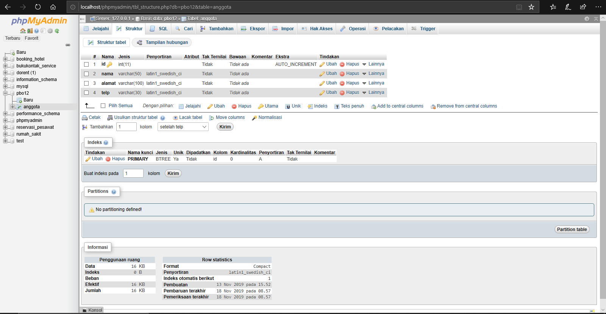

 Praktikum #12 - Java API

## Kompetensi
1. Memahami cara penyimpanan objek menggunakan Collection dan Map.
2. Mengetahui pengelompokan dari Collection.
3. Mengetahui perbedaan dari interface Set, List dan Map.
4. Mengetahui penggunaan class-class dari interface Set, List, dan Map.
5. Memahami koneksi database menggunakan JDBC dan JDBC API

## Ringkasan Materi

## Percobaan
### Percobaan 1 - Set
Pada percobaan ini, kita membuat sebuah class bernama DemoHashSet1841720004Bella, yang dimana kita belajar mengenai Set dalam Java API. Berikut adalah hasil dari percobaan 1:

Link: [DemoHashSet1841720004Bella.java](../../src/12_Java_API/DemoHashSet1841720004Bella.java)

### Percobaan 2 - List
Pada percobaan 2 ini, kita  belajar mengenai fungsi Array List dalam Java API. Berikut adalah hasil percobaan 2:

Link: [CobaArrayList1841720004Bella.java](../../src/12_Java_API/CobaArrayList1841720004Bella.java)

### Percobaan 3 - Map
pada percobaan 3 ini, kita belajar mengenai Map dalam Java API dengan nama class DemoHashMap1841720004Bella. Berikut adalah hasilnya:

Link: [DemoHashMap1841720004Bella.java](../../src/12_Java_API/DemoHashMap1841720004Bella.java)

### Percobaan 4 - Implementasi ArrayList dalam GUI
Pada percobaan 4 ini, kita belajar mengenai implementasi ArrayList dalam GUI. Berikut adalah hasilnya:

Link: [Mahasiswa1841720004Bella.java](../../src/12_Java_API/Mahasiswa1841720004Bella.java)

Link: [TampilGui1841720004Bella.java](../../src/12_Java_API/TampilGui1841720004Bella.java)

### Percobaan 5 - Aplikasi Biodata
Pada percobaan ini, kita membuat aplikasi biodata yang dimana kita menyambungkan dengan database. Database yang digunakan MySql bernama pbo12 yag berisikan table anggota. Berikut adalah gambar table pbo12 di MySql:

Berikut adalah hasilnya: 

## Pertanyaan
1. Apakah fungsi import java.util.*; pada program diatas!

    **Jawaban:**

    Meng-import semua kelas di dalam java.

2. Pada baris program keberapakah yang berfungsi untuk menciptakan object HashSet?

    **Jawaban:**

    Pada baris ke 19.

        Set mSetCity = new HashSet();

3. Apakah fungsi potongan program dibawah ini pada percobaan 1!

    

    **Jawaban:**
    
    Digunakan untuk menambahkan data ke dalam Array yang bernama mSetCity.

4. Tambahkan set.add(“Malang”); kemudian jalankan program! Amati hasilnya dan jelaskan
mengapa terjadi error!

    **Jawaban:**

    Karena dalam fungsi Set, objeck / anggota yang tersimpan harus unik, tidak boleh sama.

5. Jelaskan fungsi potongan program dibawah ini pada percobaan 1!

    

    **Jawaban:**

    Iterator digunakan untuk perulangan dalam sebuah object HashMap.

    hasNext digunakan untuk memeriksa apakah pada objeck mIterator masih memiliki data selanjutnya, jika ada maka akan ditampilkan (dijadikan output)

    next() digunakan untuk mengambil data selanjutnya.

    toLowerCase() digunakan untuk data yang ditampilkan menjadi huruf kecil semua.

6. Apakah fungsi potongan program dibawah ini!

    

    **Jawaban:**

    Digunakan untuk menampilkan isi dari mListCountry.

7. Ganti potongan program pada soal no 1 menjadi sebagai berikut: 

    

    Kemudian jalankan program tersebut!

    **Jawaban:**

    Berikut adalah hasilnya:

    

    Data akan ditampilkan namun secara sejajar dengan menggunakan fungsi Iterator.

8. Jelaskan perbedaan menampilkan data pada ArrayList menggunakan potongan program pada soal no 6 dan no 7!

    **Jawaban:**

    Pada nno 6, data ditampilkan dengan cara mengambil apa yang ingin ditampilkan dengan menggunakan fungsi get().

    Sedangkan pada no 7, menampilkan seluruh isi dari mListCountry dengan fungsi Iterator.

9. Jelaskan fungsi hMapItem.put("1","Biskuit") pada program!

    **Jawaban:** 

    Menambahkan data kedalam hMapItem dengan fungsi put().

10. Jelaskan fungsi hMapItem.size() pada program!

    **Jawaban:**

    Digunakan untuk mengambil ukuran HashMap (jumlah item pada HashMap).

11. Jelaskan fungsi hMapItem.remove("1") pada program!

    **Jawaban:**

    Digunakan untuk menghapus isi / nilai dari hashMap yaitu nilai 1.

12. Jelaskan fungsi hMapItem.clear() pada program!

    **Jawaban:**

    Digunakan untuk menghapus seluruh isi hashMap.

13. Tambahkan kode program yang di blok pada program yang sudah anda buat!

    

    **Jawaban:**

    Berikut adalah gambar script yang sudah saya tambahkan sesuai perintah:

    

14. Jalankan program dan amati apa yang terjadi!

    **Jawaban:**

    Maka data (isi dari mIterator) ditampilkan semuanya.

15. Apakah perbedaan program sebelumnya dan setelah ditambahkan kode program pada soal no 13 diatas? Jelaskan!

    **Jawaban:**

    Data yang ditampilkan akan langsung semuanya, sedangkan sebelum ditambahkan data yang ditampilkan beserta nomernya dan dalam tanda kurung kurawal.

16. Setelah menambah code pada action button klik, coba jalankan program dan tambahkan data. Apakah program berhasil menambahkan data? Jika tidak apakah penyebabnya.

    **Jawaban:**

    Tidak bisa menambahkan data, karena gagal memuat koneksi ke MySqlnya.

17. Jelaskan maksud source code untuk melakukan insert data diatas (percobaan 5)?

    **Jawaban:**

    Menambahkan data ke table anggota yang dimana didapat dari textfield dengan variable jTFNama, jTFAlamat, jTFTelepon.

18. Buat Table model yang digunakan untuk memanipulasi tampilan pada Jtable, seperti pada code dibawah ini:

    

## Kesimpulan
Pada jobsheet kali ini, kita mempelajari tentang penyimpanan objek menggunakan collection dan map, pengelompokan dari collection, perbedaan interface Set, List dan Map, penggunaan class-class dari interface Set, List dan Map, dan juga koneksi database menggunakan JDBC API (mysql).

## Pernyataan Diri

Saya menyatakan isi tugas, kode program, dan laporan praktikum ini dibuat oleh saya sendiri. Saya tidak melakukan plagiasi, kecurangan, menyalin/menggandakan milik orang lain.

Jika saya melakukan plagiasi, kecurangan, atau melanggar hak kekayaan intelektual, saya siap untuk mendapat sanksi atau hukuman sesuai peraturan perundang-undangan yang berlaku.

Ttd,

_**(Bella Setyowati)**_