# Laporan Praktikum #14 -  GUI dan Database

## Kompetensi
Setelah menempuh materi percobaan ini, mahasiswa mampu mengenal:
1. Menggunakan paradigma berorientasi objek untuk interaksi dengan database
2. Membuat backend dan frontend
3. Membuat form sebagai frontend

## Ringkasan Materi
Tahapan untuk membuat aplikasi berbasis database dan dilengkappi dengan form GUI:
1. Membuat database dan tabel-tabelnya.
2. Membuat backend yang berisi class-class yang mewakili data yang ada pada database dan class helper untuk melakukan eksekusi query database.
3. Membuat frontend yang merupakan antarmuka kepada pengguna. Frontend ini bisa berbasis teks (console), GUI, web, mobile, dan sebagainya.

## Percobaan
### Percobaan 1
Pada percobaan ini, kita membuat sebuah database MYSQL dengan nama **dbperpus** yang diamana terdapat tabel kategori, buku, anggota dan juga peminjaman. Berikut adalah gambar dari datbase yang kuta buat:

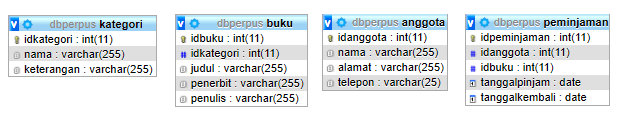

### Percobaan 2
Pada percobaan 2, kita mempersiapkan project yang dimana memberi nama sebuah project dengan nama Perpustakaan1841720004Bella dan di dalam project tersebut terdapat packages bernama bella.guidbs.frontend dan bella.guidbs.backend. Berikut adalah hasilnya:

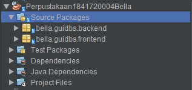

### Percobaan 3
Pada percobaan 3, kita membuat sebuah class bernama DBHeler1841720004Bella yang di tempatkan di package bella.guidbs.backend. DBHelper digunakan untuk memuat koneksi ke database, melakukan CRUD, dan mengeksekusi query select yang mengembalikan nilai query. Berikut adalah hasilnya:

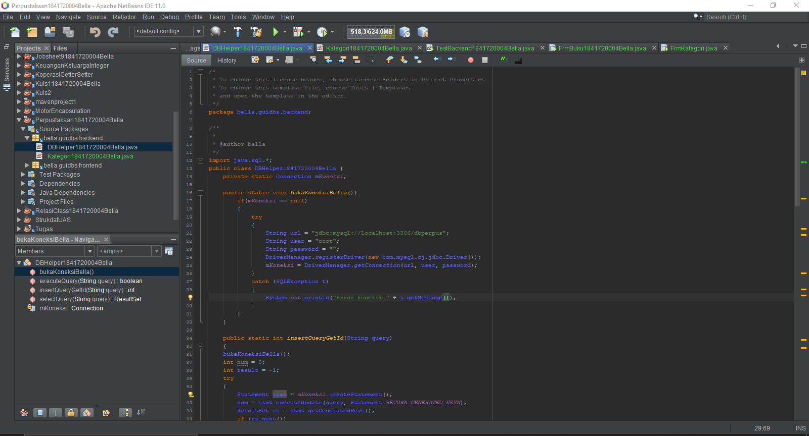

Link: [DBHelper1841720004Bella.java](../../src/14_GUI_dan_Database/DBHelper1841720004Bella.java)

### Percobaan 4
Pada percobaan 4, kita membuat sebuah class bernama Kategori1841720004Bella yang digunakan untuk menghandle CRUD pada tabel kategori. Berikut adalah hasilnya:

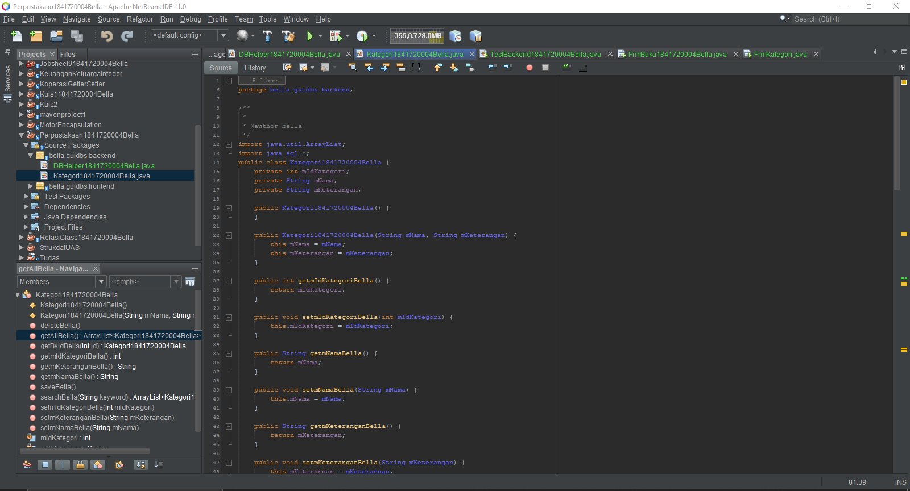

Link: [Kategori1841720004Bella.java](../../src/14_GUI_dan_Database/Kategori1841720004Bella.java)

### Percobaan 5
Pada percobaan 5, kita membuat sebuah class bernama TestBackend1841720004Bella yang digunakan untuk mengetes class pada percobaan 4 tadi berjalan dan berfungsi dengan baik. Berikut adalah hasiilnya:

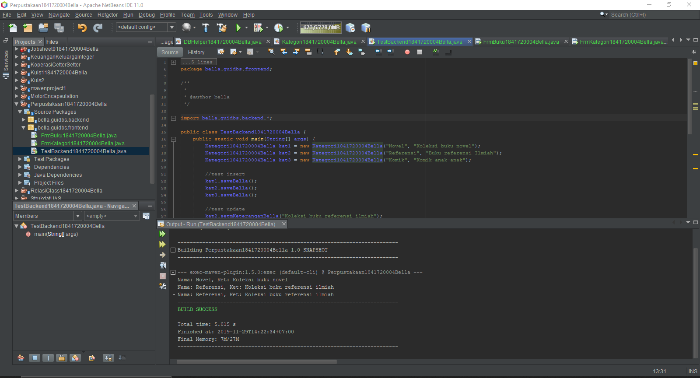

Link: [TestBackend1841720004Bella.java](../../src/14_GUI_dan_Database/TestBackend1841720004Bella.java)

### Percobaan 6
Pada percobaan 6, kita membuat interface GUI yang bernama FrmKategori1841720004Bella. Berikut adalah hasilnya:

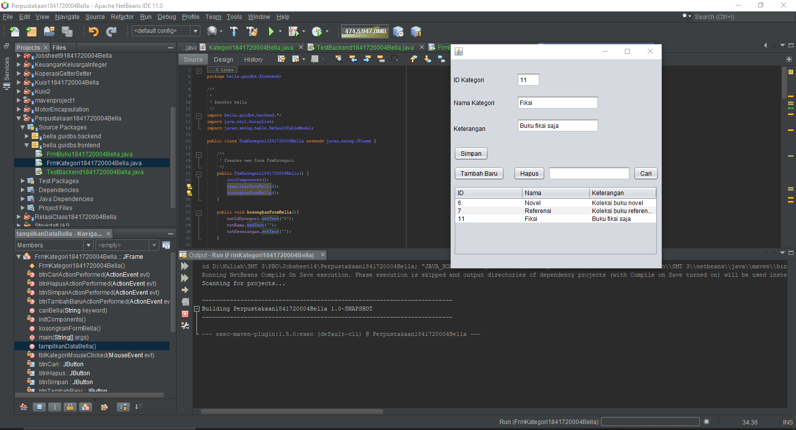

Link: [FrmKategori1841720004Bella.java](../../src/14_GUI_dan_Database/FrmKategori1841720004Bella.java)

Link: [FrmKategori1841720004Bella.form](../../src/14_GUI_dan_Database/FrmKategori1841720004Bella.form)

### Percobaan 7
Pada percobaan 7, kita membuat seperti pada percobaan 3 sampai 6 yang akan menghandle CRUD pada tabel Anggota. Berikut adalah hasilnya:

- Backend

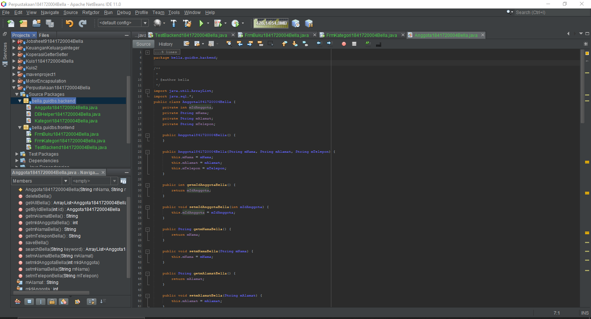

- Test Backend

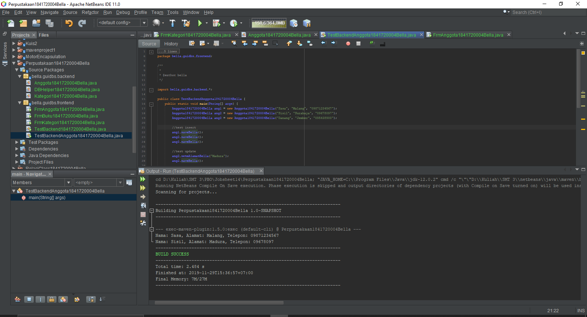

- Simpan

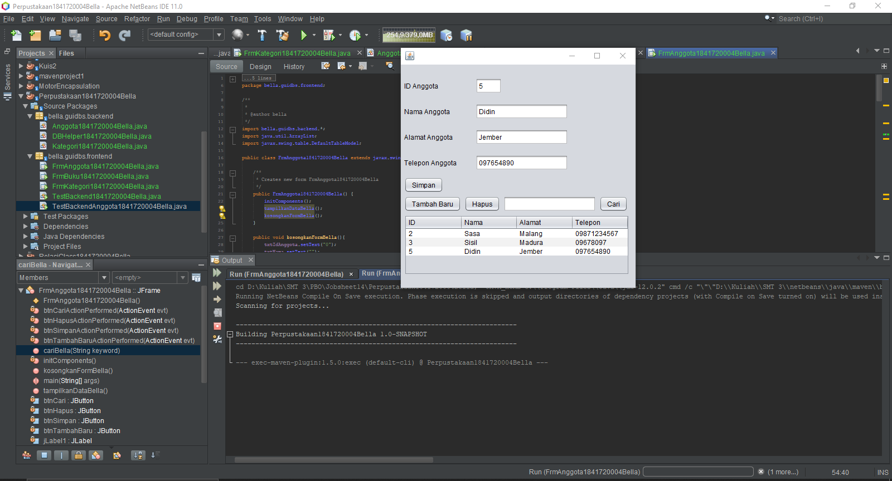

- Search

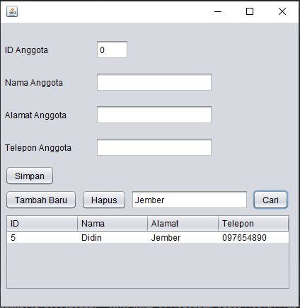

- Delete

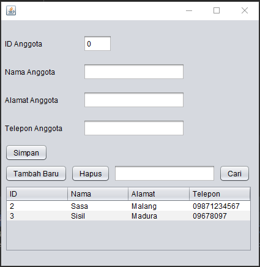

- Tambah Baru

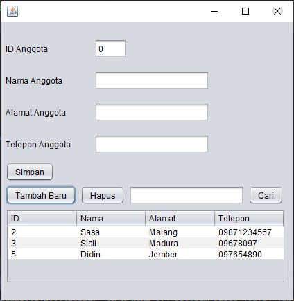

Link: [Anggota1841720004Bella.java](../../src/14_GUI_dan_Database/Anggota1841720004Bella.java)

Link: [TestBackendAnggota1841720004Bella.java](../../src/14_GUI_dan_Database/TestBackendAnggota1841720004Bella.java)

Link: [FrmAnggota1841720004Bella.java](../../src/14_GUI_dan_Database/FrmKategori1841720004Bella.java)

Link: [FrmAnggota1841720004Bella.form](../../src/14_GUI_dan_Database/FrmKategori1841720004Bella.form)

### Perobaan 8
Pada percobaan 8, sama seperti dengan percobaan 7 yang digunakan untuk meghandle CRUD pada tabel buku. Hanya saja program pada GUI-nya sedikit berbeda. Berikut adalah hasilnya:

- Backend

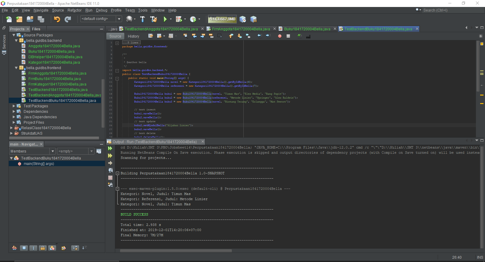

- Simpan

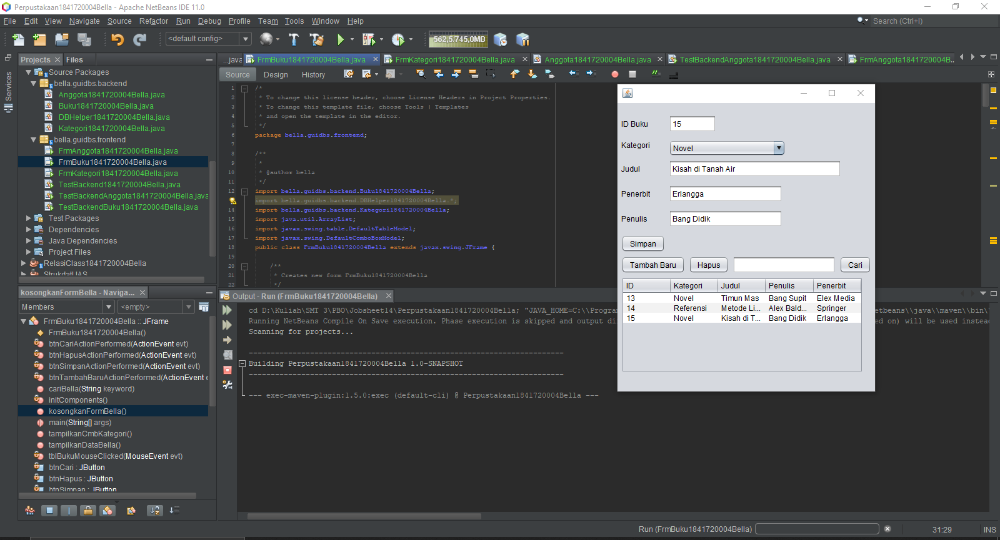

- Search

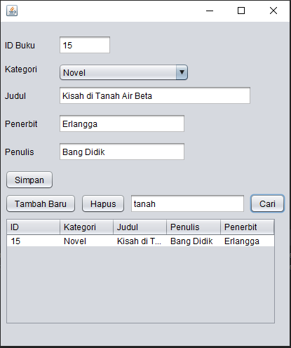

- Delete

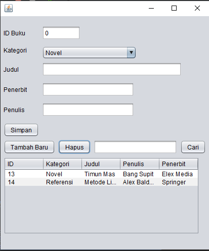

- Tambah Baru

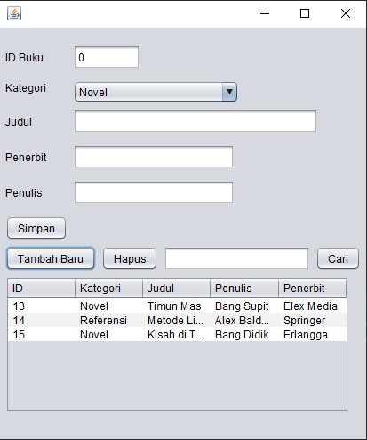

Link: [Buku1841720004Bella.java](../../src/14_GUI_dan_Database/Buku1841720004Bella.java)

Link: [TestBackendBuku1841720004Bella.java](../../src/14_GUI_dan_Database/TestBackendBuku1841720004Bella.java)

Link: [FrmBuku1841720004Bella.java](../../src/14_GUI_dan_Database/FrmBuku1841720004Bella.java)

Link: [FrmBuku1841720004Bella.form](../../src/14_GUI_dan_Database/FrmBuku1841720004Bella.form)

## Tugas
1. Buatlah class Peminjaman1841720004Bella.

    **Jawaban:**

    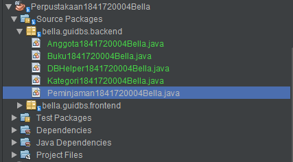

2. Buatlah form FrmPeminjaman1841720004Bella dan susun sebagai berikut:

    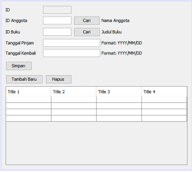

    **Jawaban:**

    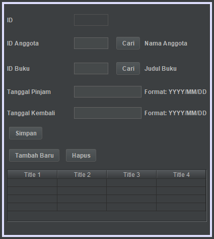

3. Atur kode program agar dapat menangani transaksi peminjaman dan pengembalian. 

    Note: 

    Pada textbox ID Anggota, pengguna tinggal memasukkan ID anggota, kemudian menekan tombol Cari. Jika ketemu, maka label “Nama Anggota” yang ada di samping tombol Cari tersebut akan menampilkan nama anggota dari ID yang dimasukkan tadi. Begitu juga dengan ID Buku.

    **Jawaban:**

    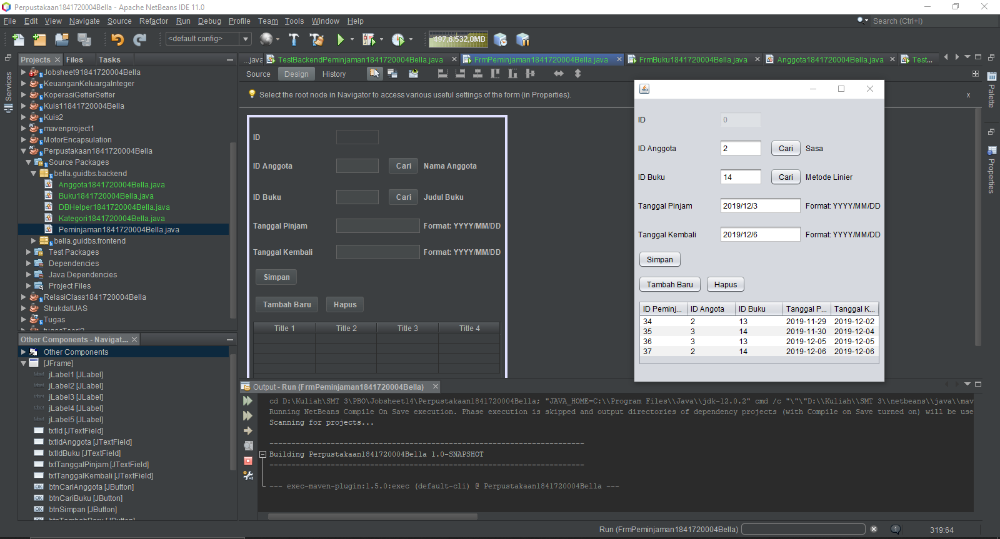

    Link: [Peminjaman1841720004Bella.java](../../src/14_GUI_dan_Database/Peminjaman1841720004Bella.java)

    Link: [TestBackendPeminjaman1841720004Bella.java](../../src/14_GUI_dan_Database/TestBackendPeminjaman1841720004Bella.java)

    Link: [FrmPeminjaman1841720004Bella.java](../../src/14_GUI_dan_Database/FrmPeminjaman1841720004Bella.java)

    Link: [FrmPeminjaman1841720004Bella.form](../../src/14_GUI_dan_Database/FrmPeminjaman1841720004Bella.form)

## Kesimpulan
Pada jobsheet ini, kita belajar mengenai GUI dan database pada netbeans yang dimana kita mengolah sebuah database melalui GUI netbeans (CRUD). Jobsheet ini juga mengajarkan tentang backend dan frontend pada netbeans.

## Pernyataan Diri

Saya menyatakan isi tugas, kode program, dan laporan praktikum ini dibuat oleh saya sendiri. Saya tidak melakukan plagiasi, kecurangan, menyalin/menggandakan milik orang lain.

Jika saya melakukan plagiasi, kecurangan, atau melanggar hak kekayaan intelektual, saya siap untuk mendapat sanksi atau hukuman sesuai peraturan perundang-undangan yang berlaku.

Ttd,

_**(Bella Setyowati)**_
