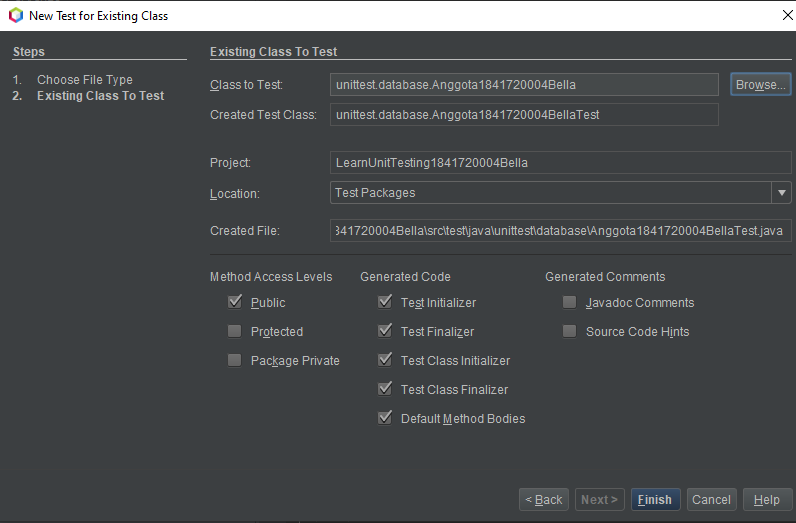

# Laporan Praktikum #15 - Unit Testing

## Kompetensi
Setelah menyelesaikan lembar kerja ini mahasiswa diharapkan mampu:
1. Memahami konsep dan fungsi unit testing
2. Menerapkan unit testing dengan JUnit pada program sederhana.
3. Menerapkan unit testing dengan JUnit pada progam yang terkoneksi database

## Ringkasan Materi
Unit Testing adalah sebuah metode untuk menguji apakah fungsi dari kode-kode yang sudah dibuat sudah berjalan dengan baik atau tidak.

Pada netbeans, agar kita bisa melakukan testing pada program yang sudah kita buat menggunakan library jUnit. Dan penempatan kode program testing terletak pada Test Package.

## Percobaan
### Percobaan 1 - Dasar Unit Testing

Pada percobaan yang pertama ini kita akan membuat sebuah program sederhana yang mengilustrasikan sebuah aplikasi pengiriman pesan. Pada program tersebut terdapat satu class utama dimana didalamnya terdapat beberapa method sederhana yang nantinya akan dibuatkan unit test-nya. Class yang dibuat yaitu MessageProcessor1841720004Bella.java pada folder Test Packager di package unittest dan juga membuat class LearnUnitTesting1841720004Bella.java. Kemudian membuat sebuah baru bernama MessageProcessorTest1841720004Bella.java dan TestRunner1841720004Bella.java. Jangan lupa untuk menambahkan library jUnit, agar program dapat berjalan. Berikut adalah hasil program yang telah saya buat:

Link: [MessageProcessor1841720004Bella.java](../../src/15_Unit_Testing/test/java/unittest/MessageProcessor1841720004Bella.java)

Link: [LearnUnitTesting1841720004Bella.java](../../src/15_Unit_Testing/test/java/unittest/LearnUnitTesting1841720004Bella.java)

Link: [MessageProcessorTest1841720004Bella.java](../../src/15_Unit_Testing/test/java/unittest/MessageProcessorTest1841720004Bella.java)

Link: [TestRunner1841720004Bella.java](../../src/15_Unit_Testing/test/java/unittest/TestRunner1841720004Bella.java)

### Percobaan 2 - Unit Testing dengan Test Case

Pada percobaan kedua kita akan mencoba membuat test case dari salah satu percobaan pada jobsheet minggu ke 14. Struktur file dari percobaan ke satu terdiri dari 4 file class yaitu DBHelper1841720004Bella.java, FrmKategori1841720004Bella.java, Kategori1841720004Bella.java dan TestBackend1841720004Bella.java. 

Ada beberapa step yang harus dilakukan agar percobaan 2 ini berjalan dengan lancar dan tanpa kebingungan:

1. Membuat packages dengan nama unittest.database yang berisikan  4 file class yang sudah disebutkan di atas di Source Packages.

    

2. Pada package unittest.database yang berada di Test Package klik kanan - pilih New - Other.

    

3. Kemudian pilih Unit Test dan pilih Test for Existing Class. 

    

4. klik Browse… lalu pilih class Kategori1841720004Bella.java, karena class ini lah yang akan kita buatkan unit testnya. Dijendela dialog yang muncul berikutnya klik Finish. Berikut adalah hasil program yang sudah saya buat:

    

5. Maka akan otomatis membuat class bernama Kategori1841720004BellaTest.java. Perhatikan isinya dan hapus method get test, set test, dan sisakan method seperti gambar di bawah ini dan edit class tersebut seperti gambar di bawah ini:

    

6. Tambahkan potongan program berikut pada file TestRunner1841720004Bella.

    mResult = new JUnitCore().runClasses(Kategori1841720004BellaTest.class);
    showMessageResultBella(mResult, Kategori1841720004BellaTest.class.getSimpleName());

    Class TestRunner1841720004Bella sudah saya copy dan rename dengan nama baru yaitu TestRunner1841720004Bella1.java agar dapat membandingkan sebelum diubah dan sesudah diubah.

7. Lalu jalankan class TestRunner1841720004Bella.

Berikut ini adalah hasil dari program yang sudah saya buat:

Link:[DBHelper1841720004Bella.java](../../src/15_Unit_Testing/main/java/unittest/database/DBHelper1841720004Bella.java)

Link: [Kategori1841720004Bella.java](../../src/15_Unit_Testing/main/java/unittest/database/Kategori1841720004Bella.java)

Link: [FrmKategori1841720004Bella.java](../../src/15_Unit_Testing/main/java/unittest/database/FrmKategori1841720004Bella.java)

Link: [TestBackend1841720004Bella.java](../../src/15_Unit_Testing/main/java/unittest/database/TestBackend1841720004Bella.java)

Link: [TestRunner1841720004Bella1.java](../../src/15_Unit_Testing/test/java/unittest/TestRunner1841720004Bella1.java)

## Pertanyaan
1. Pada percoban 2, run class Kategori1841720004Bella.java bagaimana hasilnya?

    **Jawaban:**

    Tidak hasilnya, karena class Kategori1841720004Bella.java tidak dapat di run karena tidak memiliki class main di dalamnya.

## Tugas
Buat test case untuk percobaan kedua pada jobsheet ke 14.

**Jawaban:**

Untuk class Anggota yaitu sebagai berikut:

1. Tambahkan file berikut ke dalam package unittest.database.

    

2. Pada package unittest.database yang berada di Test Package klik kanan - pilih New - Other.

    

3. Kemudian pilih Unit Test dan pilih Test for Existing Class.

    

4. klik Browse… lalu pilih class Anggota1841720004Bella.java, karena class ini lah yang akan kita buatkan unit testnya. Dijendela dialog yang muncul berikutnya klik Finish. Berikut adalah hasil program yang sudah saya buat:

    

5. Maka akan otomatis membuat class bernama Anggota1841720004BellaTest.java. Perhatikan isinya dan hapus method get test, set test, dan sisakan method seperti gambar di bawah ini dan edit class tersebut seperti gambar di bawah ini:

    

6. Buat file bernama TestRunnerAnggota1841720004Bella lalu jalankan.

Berikut adalah hasil program yang saya buat:

Link: (Anggota1841720004Bella.java)[../../src/15_Unit_Testing/main/java/unittest/database/Anggota1841720004Bella.java]

Link: (FrmAnggota1841720004Bella.java)[../../src/15_Unit_Testing/main/java/unittest/database/FrmAnggota1841720004Bella.java]

Link: (TestBackendAnggota1841720004Bella.java)[../../src/15_Unit_Testing/main/java/unittest/database/TestBackendAnggota1841720004Bella.java]

Link: [TestRunnerAnggota1841720004Bella.java](../../src/15_Unit_Testing/test/java/unittest/TestRunnerAnggota1841720004Bella.java) 

## Kesimpulan
Pada percobaan ini, kita mempelajari bagaimana membuat Unit Testing pada netbeans dan juga mempelajari bagaimmana Unit Testing dengan Test Case.

## Pernyataan Diri

Saya menyatakan isi tugas, kode program, dan laporan praktikum ini dibuat oleh saya sendiri. Saya tidak melakukan plagiasi, kecurangan, menyalin/menggandakan milik orang lain.

Jika saya melakukan plagiasi, kecurangan, atau melanggar hak kekayaan intelektual, saya siap untuk mendapat sanksi atau hukuman sesuai peraturan perundang-undangan yang berlaku.

Ttd,

_**(Bella Setyowati)**_