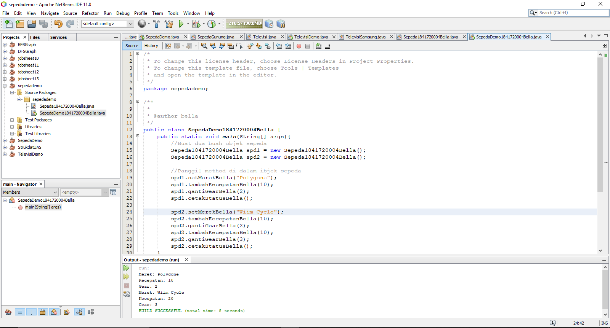
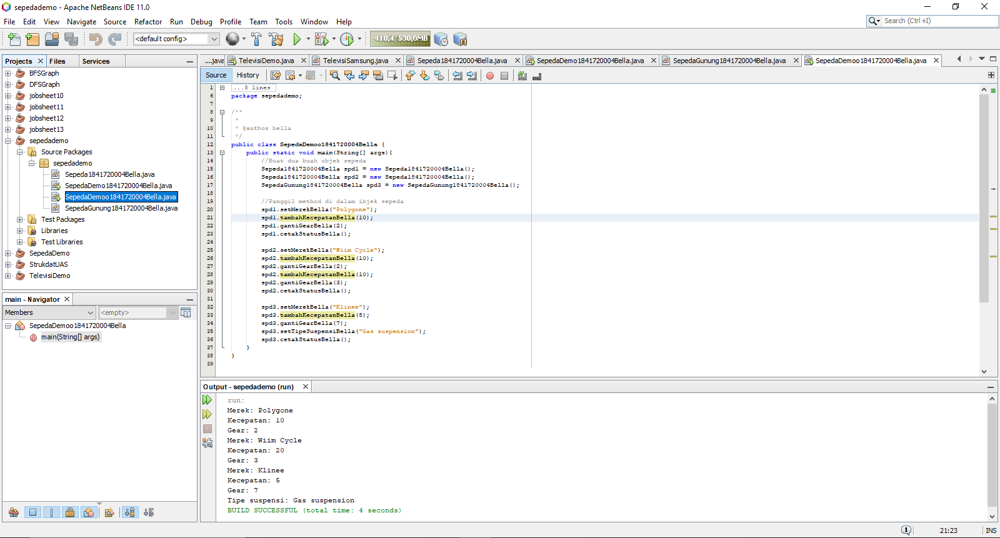
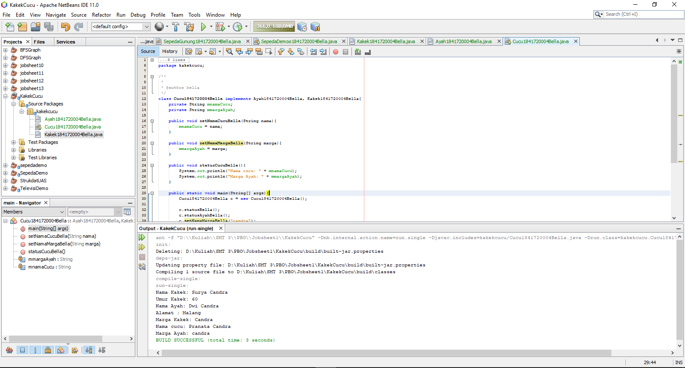
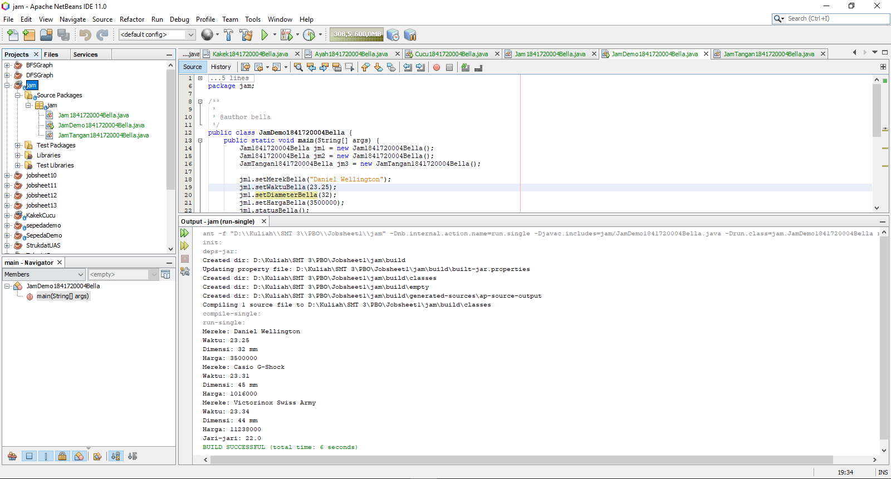


# Laporan Praktikum #1 - Pengantar Konsep PBO

## Kompetensi

Setelah menempuh materi percobaan ini, mahasiswa mampu mengenal:  
1. Perbedaan paradigma berorientasi objek dengan paradigma struktural  
2. Konsep dasar PBO

## Ringkasan Materi

Perbedaan OOP dan pemrograman struktural yang mendasar yaitu: pada OOP, program dipecah ke dalam objek-objek, sedangkan struktural program dipecah ke dalam fungsi. keuntungan menggunakan OOP yaitu OOP lebih efisien karena OOP lebih mudah dipahami, sehingga untuk melakukan peng-edit-an sangat mudah.
Ada 4 pilar dalam OOP:
1. Abstraction.
2. Encapsulation.
3. Inheritance.
4. Polymorfism.

Lalu, apakah bisa cucu mengakses kakek pada kasus kakek cucu (multiple inheritance)?
Setelah saya cari tau dan mencoba, ternyata java tidak mendukung multiple inheritance pada classes. Kenapa? Karena dapat menyebabkan *Diamond Problem*, penangan multiple inheritance yang sangat rumit menyebabkan multiple inheritance sangat komplex.
Sehingga agar bisa menggunkan multiple inheritance, saya menggunanakan implements. Untuk lebih jelasnya akan saya taruh hasil percobaan saya di bawah percobaan 2 dengan nama percobaan 3 (Kakek-Cucu).

## Percobaan

### Percobaan 1

Pada percobaan ini kita membuat sebuah class Sepeda1841720004Bella.java dan membuat class SepedaDemo1841720004Bella.java sebagai class main-nya. Jika dijalankan / run, maka hasilnya seperti gambar berikut:

Link program Sepeda1841720004Bella.java : [Sepeda1841720004Bella.java](../../src/1_Pengantar_Konsep_PBO/Sepeda1841720004Bella.java)

Link program SepedaDemo1841720004Bella.java : [SepedaDemo1841720004Bella.java](../../src/1_Pengantar_Konsep_PBO/SepedaDemo1841720004Bella.java)

### Percobaan 2
Pada percobaan kali ini, kita membuat sebuah class baru bernama SepedaGunung1841720004Bella.java yang merupakan turunan dari Sepeda1841720004Bella.java. Lalu kita juga men-edit script yang berada di SepedaDemo1841720004Bella.java. Tampilan hasil yang sudah di run sebagai berikut:

Link program SepedaDemo1841720004Bella.java : [SepedaDemoo1841720004Bella.java](../../src/1_Pengantar_Konsep_PBO/SepedaDemoo1841720004Bella.java)

Link program SepedaGunung1841720004Bella.java : [SepedaGunung1841720004Bella.java](../../src/1_Pengantar_Konsep_PBO/SepedaGunung1841720004Bella.java)

### Percobaan 3 (Kakek - Cucu)
Ini merupakan percobaan saya pribadi mengenai multiple inheritance (cucu mengakses kakek).

Link program Kakek1841720004Bella.java : [Kakek1841720004Bella.java](../../src/1_Pengantar_Konsep_PBO/Kakek1841720004Bella.java)

Link program Ayah1841720004.java : [Ayah1841720004Bella.java](../../src/1_Pengantar_Konsep_PBO/Ayah1841720004Bella.java)

Link program Cucu1841720004.java : [Cucu1841720004Bella.java](../../src/1_Pengantar_Konsep_PBO/Cucu1841720004Bella.java)
 
## Pertanyaan

1. Sebutkan dan jelaskan aspek-aspek yang ada pada pemrograman berorientasi objek!
**Jawaban**:

a. Objek = program yang memiliki atribut dan perilaku yang dapat dilakukan oleh objek tersebut.

b. Class = rancangan dari suatu objek.

c. Enkapsulasi = penyembunyian informasi yang difokuskan pada antarmukanya.

src: [Sedikit Tentang Enkapsulasi PBO](https://diskusikuliah.wordpress.com/2010/03/04/sedikit-tentang-enkapsulasi-pbo/)

d. Inheritance: suatu kelas dapat membuat kelas baru yang sifatnya sama dengan orang tua nya.

e. Polimorfism: merupakan kelas yang berbeda-beda yang berasal dari satu orang tua dan mempunyai method yang sama juga, namun  pelaksanaannya dapat berbeda-beda.

src: [Konsep OOP (Enkapsulasi, Inheritance dan Polimorfisme) dengan Pemrograman Java - Animal](https://dede-note.blogspot.com/2013/10/konsep-oop-enkapsulasi-inheritance-dan.html)

2. apa yang dimaksud dengan object dan apa bedanya dengan class?
**Jawaban:**
**Objek** adalah suatu program yang memiliki atribut dan perilaku yang dapat dilakukan oleh objek tersebut. Dan **class** adalah suatu rancangan dari objek.

3. Sebutkan salah satu kelebihan utama dari pemrograman berorientasi objek dibandingkan dengan pemrograman struktural!
**Jawaban:**
salah satu kelebihan OOP adalah OOP lebih efiesien dan mudah dipahami dibandingkan dengan pemrograman struktural.

4. pada class Sepeda, terdapat state/atribut apa saja?
**Jawaban:**
Atribut merek, kecepatan dan gear.

5. Tambahkan atribut **warna** pada class Sepeda.
**Jawaban:**
private String mwarna;

6. Mengapa pada saat kita membuat class SepedaGunung, kita tidak perlu membuat class nya dari nol?
**Jawaban:**
Karena class SepedaGunung merupakan class turunan dari class Sepeda, sehingga tidak perlu membuat class nya dari nol.

## Tugas

`screenshot`:

Link program Jam1841720004Bella.java : [Jam1841720004Bella.java](../../src/1_Pengantar_Konsep_PBO/Jam1841720004Bella.java)

Link program JamTangan1841720004.java : [JamTangan1841720004Bella.java](../../src/1_Pengantar_Konsep_PBO/JamTangan1841720004Bella.java)

Link program JamDemo1841720004.java : [JamDemo1841720004Bella.java](../../src/1_Pengantar_Konsep_PBO/JamDemo1841720004Bella.java)

## Kesimpulan

Dari percobaaan di atas, kita telah mempresentasikan **inheritance** / pewarisan, yaitu pada class SepedaGunung1841720004Bella.java. Class tersebut merupakan class turunan dari class Sepeda18841720004Bella.java.
Pada class SepedaGunung1841720004Bella.java, atribut yang ditambahkan yaitu tipe suspensi.
Dan untuk percobaan saya sendiri, dapat saya simpulkan bahwa Jawa tidak mendukung multiple inheritance seperti kata saya di atas tadi, karena bisa menimbulkan *Diamond Problem*. Jadi, untuk itu saya menggunakan implements pada percobaan saya.
Untuk percobaan, saya menggunakan beberapa laman web sebagai referensi dan pemecahan masalah:
1. [Java and Multiple Inheritance](https://www.geeksforgeeks.org/java-and-multiple-inheritance/)
2. [Multiple Inheritance in Java](https://www.journaldev.com/1775/multiple-inheritance-in-java)
3. [Stack Overflow](https://stackoverflow.com/questions/2333285/java-lang-runtimeexception-uncompilable-source-code-what-can-cause-this)

## Pernyataan Diri

Saya menyatakan isi tugas, kode program, dan laporan praktikum ini dibuat oleh saya sendiri. Saya tidak melakukan plagiasi, kecurangan, menyalin/menggandakan milik orang lain.

Jika saya melakukan plagiasi, kecurangan, atau melanggar hak kekayaan intelektual, saya siap untuk mendapat sanksi atau hukuman sesuai peraturan perundang-undangan yang berlaku.

Ttd,

_**(Bella Setyowati)**_
