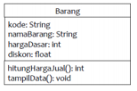

# Laporan Praktikum #2 - Class dan Object

## Kompetensi
Mahasiswa dapat memahami deskripsi dari class dan object
1. Mahasiswa memahami implementasi dari class
2. Mahasiswa dapat memahami implementasi dari attribute
3. Mahasiswa dapat memahami implementasi dari method
4. Mahasiswa dapat memahami implementasi dari proses instansiasi
5. Mahasiswa dapat memahami implementasi dari try-catch
6. Mahasiswa dapat memahami proses pemodelan class diagram menggunakan UML

## Ringkasan Materi
Object adalah sebuah program yang memiliki atribut dan method (perilaku) sedangkan Class adalah suatu perencanaan class. Class apabila dijalankan / di-run tidak akan menampilkan apa-apa, sebaliknya jika Object di-run maka akan menampilkan sesuatu.

Perbedaan antara method bertipe void dengan method bertipe data (int, String dan lainnya) adalah

Ketika ber-method void, nilia tidak perlu untuk dikembalikan. Sedangkan methode dengan bertipe data (int, String dan lain lainnya) maka method tersebut harus mengembalikan nilai yang bertipekan sama dengan tipe data pada method. Apabila tidak sama akan menimbulkan error.

Penggunaan class diagram akan membantu kita dalam merancang struktur pada saat kita akan membuat program, sehingga akan lebih mudah dan cepat memahami. Selain itu juga, kita akan mmengetahui bagaimana hubungan antara class dengan sistem yang dibut untuk memncapai suatu tujuan.

Ada juga Try-catch, try-catch digunakan untuk menampilkan error pada program yang kita buat dan agar program tetap berjalan walaupun ada error, sehingga program tidak diberhentikan paksa.

## Percobaan

### Percobaan 1
Pada percobaan 1 ini, kita membuat sebuah class diagram dari sebuah studi kasus yang telah disiapkan. Berikut adalah studi kasus :

"Dalam suatu perusahaan salah satu data yang diolah adalah data karyawan. Setiap
karyawan memiliki id, nama, jenis kelamin, jabatan, jabatan, dan gaji. Setiap mahasiswa
juga bisa menampilkan data diri pribadi dan melihat gajinya"

Berikut adalah class diagram yang telah dibuat:

Dari gambar tersebut dapat disimpulkan bahwa class yang dapat dibuat adalah
1. Mahasiswa1841720004Bella
2. Karyawan1841720004Bella

Atribut pada class Mahasiswa1841720004Bella:
1. nim tipe datanya integer
2. nama tipe datanya String
3. alamat tipe datanya String
4. kelas tipe datanya String

Atribut pada class Karyawan1841720004Bella:
1. id tipe datanya String
2. nama tipe datanya String
3. jk tipe datanya String
4. jabatan tipe datanya String
5. gaji tipe datanya integer

Method-method yang ada pada class Mahasiswa1841720004Bella:
1. tmplBiodataBella() : void

Method-method yang ada pada class Karyawan1841720004Bella:
1. tmplKaryawanBella() : void

### Percobaan 2
Pada percobaan ini akan membuat program, bagian yang mendeklarasikan atribut dan method, menjelaskan salah satu script program dan membuat istansiasi 2 object baru program tersebut. Berikut adalah sreecshoot programnya:

Link: [Mahasiswa1841720004Bella.java](../../src/2_Class_dan_Object/Mahasiswa1841720004Bella.java)

Link: [TestMahasiswa1841720004.java](../../src/2_Class_dan_Object/TestMahasiswa1841720004/java)

Pendeklarasian atribut di class Mahasiswa1841720004Bella adalah:
1. public int nim;
 2.   public String nama;
   3. public String alamat;
    4. public String kelas;

Sedangkan pada class TestMahasiswa1841720004Bella tidak ada pendeklarasian atribut.

Pendeklarasian method pada class Mahasiswa1841720004Bella yaitu:
1. public void tmplBiodataBella(),

Sedangkan pada class TestMahasiswa1841720004Bella hanya pendeklarasian method main:
public static void main(String args[]),

Banyak object yang di instasisasi yaitu sebanyak 1 (Mahasiswa1841720004Bella mhs1 = new Mahasiswa1841720004Bella);,

Yang terjadi pada sintaks program “mhs1.nim=101” adalah memberikan nilai 101 kepada nim pada object mhs1.

Yang terjadi pada sintaks program “mhs1.tmplBiodataBella()” adalah memanggil method tmplBiodataBella pada class Mahasiswa1841720004Bella yang di instasiasi (mhs1).

Menambahkan 2 instansi objectpada class TestMahasiswa1841720004Bella, dapat dilihat sebgai berikut:

1. Mahasiswa1841720004Bella mhs2 = new Mahasiswa1841720004Bella();
        
2. Mahasiswa1841720004Bella mhs3 = new Mahasiswa1841720004Bella();

Programnya dapat dilihat di sini : [klik di sini](../../src/2_Class_dan_Object/TestMahasiswa21841720004Bella.java)

### Percobaan 3
Pada percobaan kali ini saya membuat class bernama Barang1841720004Bella dan class TestBarang1841720004Bella dan saya membuat method yang memiliki argumen / parameter dan memiliki return. Gambar dapat dilihat sebagai berikut:

Link : [Barang1841720004Bella.java](../../src/2_Class_dan_Object/Barang1841720004Bella.java)

Link: [TestBarang1841720004Bella.java](../../src/2_Class_dan_Object/TestBarang1841720004Bella.java)

Fungsi argumen tersebut adalah untuk menyimpan nilai yang diinputkan pada user yang akan digunakan untuk memberikan nilai yang akan di-eksekusi pada method tersebut. Dan return digunakan pada saat method tersebut menggunakan parameter, agar nilai yang ditampilkan dapat keluar. Dan return digunakan pada saat method tersebut menggunakan sebuah parameter / tidak berparameter yang memiliki tipe data (public int ....(){}).

## Tugas
1. Class diagram dari kasus berikut adalah

"Suatu toko persewaan video game salah satu yang diolah adalah peminjaman, dimana
data yang dicatat ketika ada orang yang melakukan peminjaman adalah id, nama
member, nama game, dan harga yang harus dibayar. Setiap peminjaman bisa
menampilkan data hasil peminjaman dan harga yang harus dibayar. Buatlah class
diagram pada studi kasus diatas!

Penjelasan:
1. Harga yang harus dibayar diperoleh dari lama sewa x harga.
2. Diasumsikan 1x transaksi peminjaman game yang dipinjam hanya 1 game saja."

Program yang telah dibuat adalah sebagai berikut:

Link: [Peminjaman1841720004Bella.java](../../src/2_Class_dan_Object/Peminjaman1841720004Bella.java)

Link: [TestPeminjaman1841720004Bella.java](../../src/2_Class_dan_Object/TestPeminjaman1841720004Bella.java)

2. Membuat program dari class diagram di bawah ini:

Hasil yang didapat adalah

Link: [Lingkaran1841720004Bella.java](../../src/2_Class_dan_Object/Lingkaran1841720004Bella.java)

3. Membuat program dari class diagram di bawah ini:

Dengan ketentuan sebagai berikut:
1. Nilai atribut hargaDasar dalam Rupiah dan atribut diskon dalam %
2. Method hitungHargaJual() digunakan untuk menghitung harga jual dengan perhitungan berikut ini:
**harga jual = harga dasar – (diskon x harga dasar)**
3. Method tampilData() digunakan untuk menampilkan nilai dari kode, namaBarang, hargaDasar, diskon dan harga jual.

Hasil yang didapat adalah:

Link: [Barang1841720004Bella.java](../../src/2_Class_dan_Object/Barangg1841720004Bella.java)

## Kesimpulan
Pada percobaan yang telah dilakukan, dapat disimpulkan bahwa penggunaan class diagram sangat membantu dalam pengerjaan sebuah program, karena dengan adanya class diagram kita mengetahui struktur dan penjelasan class dan juga menjelaskan mengenai hubungan antar class dengan sistem yang dibuat untuk mencapai tujuan. Dan juga terdapat method yang berparameter dan tidak berparameter, dan method tersebut memiliki tipe data seperti int, String dan lainnya. Nilai pada method tersebut akan di kembalikan nilainya dengan cara di return.

## Pernyataan Diri

Saya menyatakan isi tugas, kode program, dan laporan praktikum ini dibuat oleh saya sendiri. Saya tidak melakukan plagiasi, kecurangan, menyalin/menggandakan milik orang lain.

Jika saya melakukan plagiasi, kecurangan, atau melanggar hak kekayaan intelektual, saya siap untuk mendapat sanksi atau hukuman sesuai peraturan perundang-undangan yang berlaku.

Ttd,

_**(Bella Setyowati)**_
