# Laporan Praktikum #3 - Enkapsulasi

## Kompetensi
Setelah melakukan percobaan pada modul ini, mahasiswa memahami konsep:
1. Konstruktor
2. Akses Modifier
3. Atribut/method pada class
4. Intansiasi atribut/method
5. Setter dan getter
6. Memahami notasi pada UML Class Diagram

## Ringkasan Materi
Enkapsulasi sering juga disebut sebagai information hiding, karena enkapsulasi menyembunyiksn detail suatu proses dari object dari pengguna.

Konstruktor mirip dengan method cara deklarasinya akan tetapi tidak memiliki return. Dan konstruktor dieksekusi ketika instan dari objet yang dibuat. Ada beberapa cara atau aturan untuk menulis konstruktor, yaitu:
1. Nama konstruktor harus sama dengan class-nya.
2. konstruktor tidak memiliki tipe data return.
3. konstruktor tidak boleh menggunakan modifier abstract, static, final dan syncronized.

Ada 2 tipe akses modifier, yaitu: akses modifier dan non-access modifier. Terdapat 4 akses modifier yaitu:
1. private.
2. default.
3. protected.
4. public.

Getter berfungsi untuk mendapatkan nilai dari atribut private. Setter berfungsi untuk memanipulasi nilai dari atribut private.

Notasi akses modifier pada UML class diagram adalah sebagai berikut:
1. Tanda plus (+) untuk public
2. Tanda pagar (#) untuk protected
3. Tanda minus (-) untuk private
4. Untuk default, maka tidak diberi notas

## Percobaan

### Percobaan 1 - Enkapsulasi
Pada percobaan 1, kita membuat sebuah class bernama Motor1841720004Bella dan class MotorDemo1841720004Bella yang terdapat dalam package yang bernama motorencapsulation. Namun pada percobaan 1 ini masih terdapat kejanggalan yang dimana pada saat kecepatan dapat berubah dari 0 menjadi 50, dan pada saat kecepatan 50 kondisi motor adalah off. Berikut adalah UML class diagram class Motor:

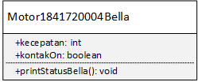
 
Berikut adalah gambar program yang dibuat:

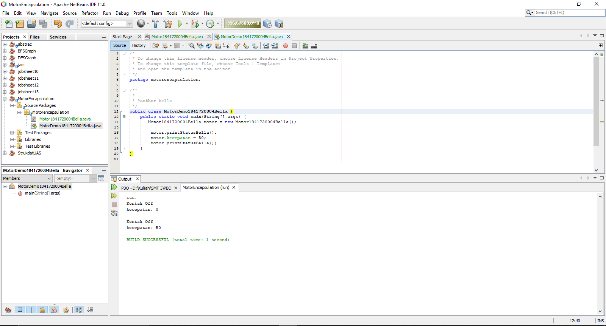

Link: [Motor1841720004Bella.java](../../src/3_Enkapsulasi/Motor1841720004Bella.java)

Link: [MotorDemo1841720004Bella.java](../../src/3_Enkapsulasi/MotorDemo1841720004Bella.java)

### Percobaan 2 - Access Modifier
Pada percobaan 2 ini, kita **memperbaiki** cara kerja class **Motor1841720004Bella** pada percobaan 1 yang telah saya duplikat classnya dengan nama **Motorr1841720004Bella** dan class **MotorDemo1841720004Bella** dengan nama class **MotorDemoo1841720004Bella**. 

Lalu apa yang membedakan? Yang membedakan adalah pada saat kita menambah kecepatan pada saat kondisi Off, maka akan muncul notifikasi bahwa kondisi mesin masih off. Berikut adalah UML class diagram Motor yang baru:

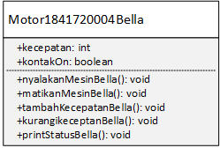

Berikut adalah gambar dari program tersebut:

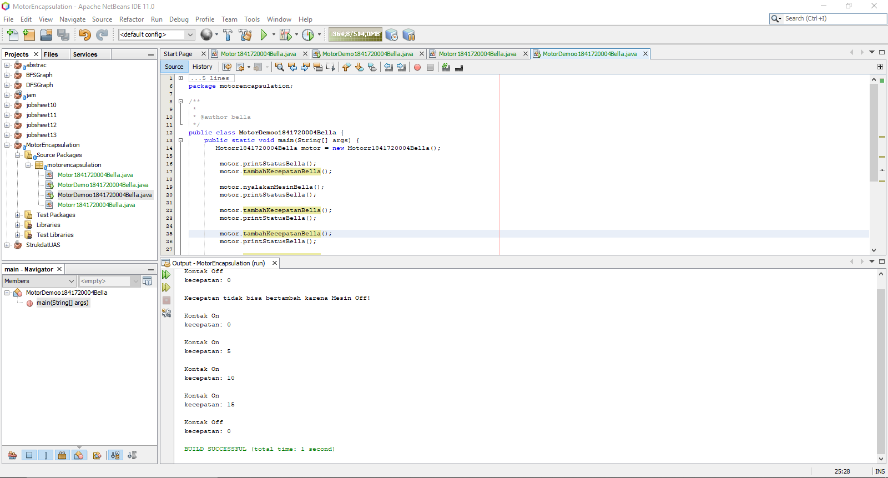

Link: [Motorr1841720004Bella.java](../../src/3_Enkapsulasi/Motorr1841720004Bella.java)

Link: [MotorDemoo1841720004Bella.java](../../src/3_Enkapsulasi/MotorDemoo1841720004Bella.java)

### Percobaan 3 - Getter dan Setter
Pada percobaan 3, kita membuat sebuah class bernama Anggota1841720004Bella dan KoperasiDemo1841720004Bella yang dimana pada percobaan ini kita akan membuat sebuah getter setter. 

>**Apa itu getter setter?**

    Seter adalah suatu method untuk mengeset / memberi nilai pada atribut.
    Getter adalah suatu method yang digunakan untuk mengambil suatu nilai atribut.

Setter pada percobaan kali ini adalah: setMnamaBella(), setMalamatBella().

Lalu untuk getter pada percobaan ini adalah: getMnamaBella(), getMalamatBella() dan getMsimpananBella().

>**Kenapa msimpanan tidak mempunyai setter?**
    
    Karena atribut msimpanan hanya akan bertambah ketika melakukan transaksi setor 
    dan akan berkurang ketika melakukan peminjaman.

Berikut adalah program dari class yang telah dibuat:

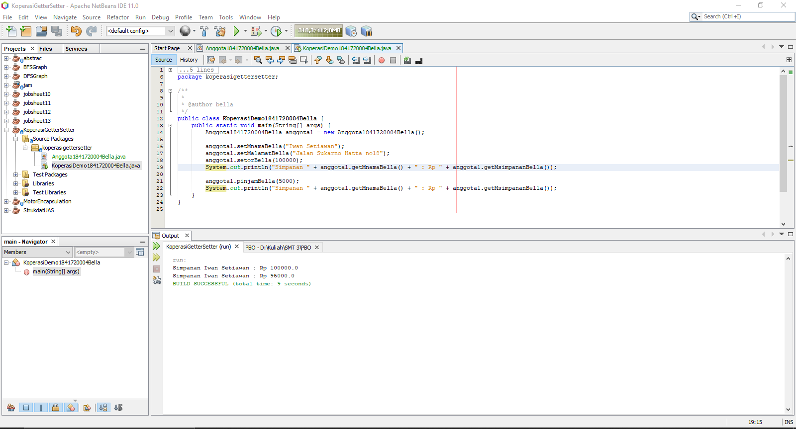

Link: [Anggota1841720004Bella.java](../../src/3_Enkapsulasi/Anggota1841720004Bella.java)

Link: [KoperasiDemo1841720004Bella.java](../../src/3_Enkapsulasi/KoperasiDemo1841720004Bella.java)

### Percobaan 4 - Konstruktor, Instansiasi
Pada percobaan 4, kita akan membuat sebuah konstruktor pada class Anggotaa184172004Bella yang dimana konstruktor tersebut berparameter. Sehingga ketika kita meng-instansiasi suatu object kita perlu mem-passing parameter. Jika tidak membutuhkan nilai spesifik dalam konstruktor tidak perlu parameter. Contohnya msimpanan untuk anggota baru diset 0, maka msimpanan tidak perlu dijadikan parameter pada konstruktor. Berikut adalah gambar dari program tersebut:

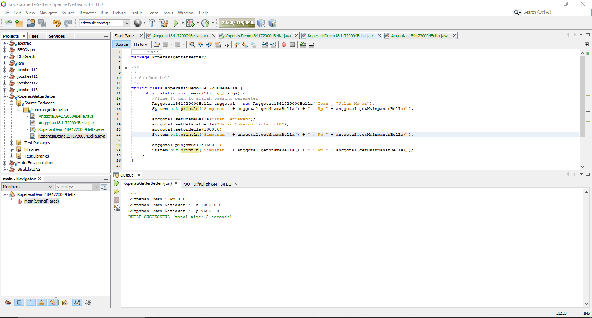

Link: [Anggotaa1841720004Bella.java](../../src/3_Enkapsulasi/Anggotaa1841720004Bella.java)

Link: [KoperasiiDemo1841720004Bella.java](../../src/3_Enkapsulasi/KoperasiiDemo1841720004Bella.java)

## Pertanyaan
1. Pada class TestMobil, saat kita menambah kecepatan untuk pertama kalinya, mengapa
muncul peringatan “Kecepatan tidak bisa bertambah karena Mesin Off!”?

    **Jawaban**:

    Karena dalam program tersebut, kecepatannya ditambah ketika mesin dalam keadaan off atau belum dinyalakan. Sehingga muncul "Kecepatan tidak bisa bertambah karena Mesin Off!" sesuai dengan isi method tambahKecepatanBella() pada class Motorr1841720004Bella.

2. Mengapat atribut kecepatan dan kontakOn diset private?

    **Jawaban**:

    Karena untuk menyembunyikan atribut internal dari pengguna class lain.

3. Ubah class Motor sehingga kecepatan maksimalnya adalah 100!

    **Jawaban**:

    Potongan program yang ditambahkan adalah sebagai berikut:
    
        if(mkecepatan >= 100){
            mkecepatan = 100;
            System.out.println("Kecepatan sudah maksimal!");
        }
    
    Untuk full programnya dapat dilihat [di sini](../../src/3_Enkapsulasi/Motoor1841720004Bella.java) pada method tambahKecepatanBella().

4. Apa yang dimaksud getter dan setter?

    **Jawaban:**

    Setter adalah suatu method untuk mengeset / memberi nilai pada atribut.

    Getter adalah suatu method yang digunakan untuk mengambil suatu nilai atribut.

5. Apa kegunaan dari method getMsimpananBella()?

    **Jawaban:**

    getMsimpananBella() digunakan untuk mendapatkan nilai pada atribut msimpanan yang telah diisi oleh user.

6. Method apa yang digunakan untk menambah saldo?

    **Jawaban:**

    Method yang digunakan adalah setorBella().

7. Apa yand dimaksud konstruktor?

    **Jawaban:**

    Konstruktor adalah suatu method yang akan memberikan nilai awal pada saat object dibuat.

8. Sebutkan aturan dalam membuat konstruktor?

    **Jawaban:**

    1. Nama konstruktor harus sama dengan nama class (huruf kecil dan besarnya).
    2. Dalam satu class dapat lebih dari satu konstruktor (berparameter dan tidak berparameter).
    3. Konstruktor tidak memiliki tipe data return.
    4. Konstruktor tidak boleh menggunakan modified abstract, static, final dan syncronized.

9. Apakah boleh konstruktor bertipe private?

    **Jawaban:**

    Tidak.

10. Kapan menggunakan parameter dengan passsing parameter?

    **Jawaban:**

    Digunakan ketika kita menginginkan atribut di setting dari awal pembuatan object untuk mendapatkan nilai yang spesifik. Passing parameter digunakan ketika kita membuat object.

11. Apa perbedaan atribut class dan instansiasi atribut?

    **Jawaban:**

    |  |  |
    |--|--|
    | Atribut class | Instansiasi atribut |
    | Atribut yang dimiliki oleh **semua** objek yang berasal dari class yang sama | Atribut yang dimiliki oleh objek dari class yang sama |
    | Semua object **memiliki nilai class variabel yang sama** | Tiap object memiliki instansiasi variabel sendiri dan menyimpan nilainya tersendiri |
    | Nilai atribut class-nya **harus** sama | Nilai instansiasi atributnya boleh sama, boleh tidak |

    Referensi: [Tentang Objek, Class, Atribut](https://oopku.blogspot.com/2012/11/tentang-objek-class-atribut.html)

12. Apa perbedaan class method dan instansiasi method?

    **Jawaban:**

    |  |  |
    |--|--|
    | Class method | Instansiasi method |
    | Dapat diakses langsung dengan nama class  |  Dipanggil / diakses menggunakan object |
    | Tidak perlu membuat sebuah object | Perlu membuat object |

    Referensi: [Quora](https://www.quora.com/What-is-the-difference-between-a-class-method-and-an-instance-method-in-Java-and-also-between-class-variable-and-instance-variable-in-Java)

## Tugas
1. Cobalah program dibawah ini dan tuliskan hasil outputnya!

    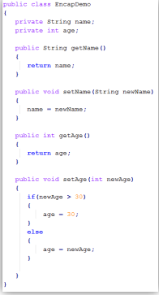 
    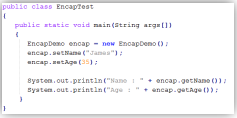

    **Jawaban:**

    Program yang didapat sebagai berikut:
    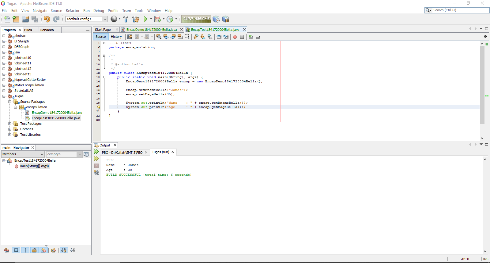

    Outputnya sebagai berikut:

        Name    : James
        Age     : 30

    Link: [EncapDemo1841720004Bella.java](../../src/3_Enkapsulasi/EncapDemo1841720004Bella.java)

    Link: [EncapTest1841720004Bella.java](../../src/3_Enkapsulasi/EncapTest1841720004Bella.java)

2. Pada program diatas, pada class EncapTest kita mengeset age dengan nilai 35, namun pada saat ditampilkan ke layar nilainya 30, jelaskan mengapa!.

    **Jawaban:**

    Karena pada method setMageBella(), terdapat sebuah percabangan (if else) yang dimana ketika age lebih dari 30 maka age akan ditampilkan 30 atau age akan diset 30. Dan ketika age kurang dari 30, maka age akan diset sesuai dengan yang diinginkan.

3. Ubah program diatas agar atribut age dapat diberi nilai maksimal 30 dan minimal 18.

    **Jawaban:**

    Hasil program yang telah diubah:
    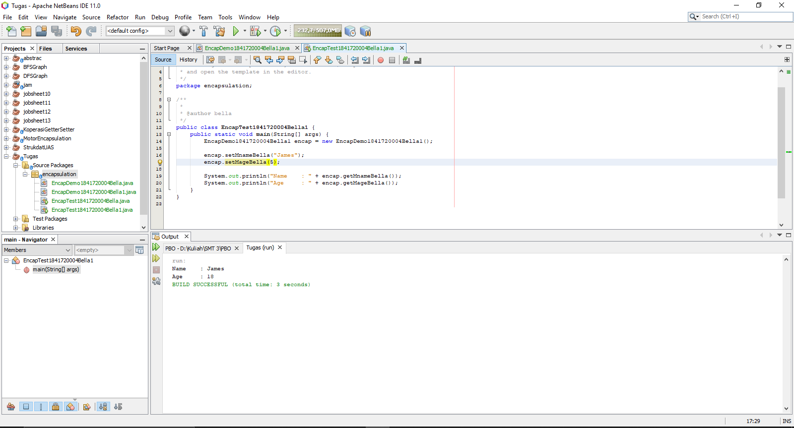

    Program yang ditambahkan pada method setMageBella(int newAge):

        else if(newAge <= 18){
            mage = 18;
        }
    Link: [EncapDemo1841720004Bella1.java](../../src/3_Enkapsulasi/EncapDemo1841720004Bella1.java)

    Link: [EncapTest1841720004Bella1.java](../../src/3_Enkapsulasi/EncapTest1841720004Bella1.java)

4. Pada sebuah sistem informasi koperasi simpan pinjam, terdapat class Anggota yang memiliki
atribut antara lain nomor KTP, nama, limit peminjaman, dan jumlah pinjaman. Anggota
dapat meminjam uang dengan batas limit peminjaman yang ditentukan. Anggota juga dapat
mengangsur pinjaman. Ketika Anggota tersebut mengangsur pinjaman, maka jumlah
pinjaman akan berkurang sesuai dengan nominal yang diangsur. Buatlah class Anggota
tersebut, berikan atribut, method dan konstruktor sesuai dengan kebutuhan. Uji dengan
TestKoperasi berikut ini untuk memeriksa apakah class Anggota yang anda buat telah sesuai
dengan yang diharapkan.

    Berikut adalah hasil yang diharapkan:
    
    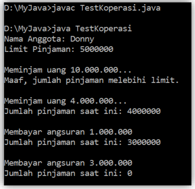

    **Jawaban:**
    Program yang telah saya buat dibuat:
    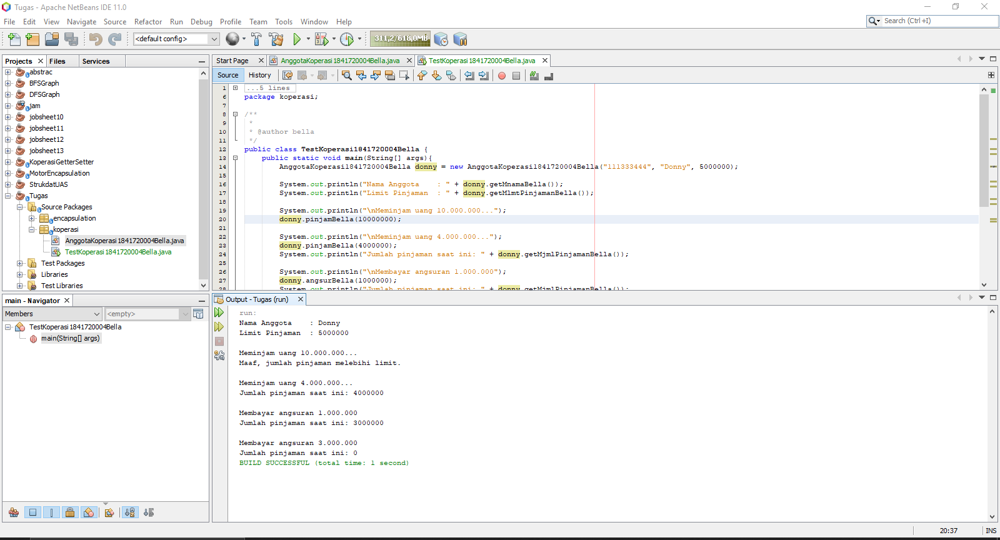

    Link: [AnggotaKoperasi1841720004Bella.java](../../src/3_Enkapsulasi/AnggotaKoperasi1841720004Bella.java)

    Link: [TestKoperasi1841720004Bella.java](../../src/3_Enkapsulasi/TestKoperasi1841720004Bella.java)

5. Modifikasi soal no. 4 agar nominal yang dapat diangsur minimal adalah 10% dari jumlah pinjaman saat ini. Jika mengangsur kurang dari itu, maka muncul peringatan “Maaf,
angsuran harus 10% dari jumlah pinjaman”.

    **Jawaban:**

    Program yang telah saya modifikasi:
    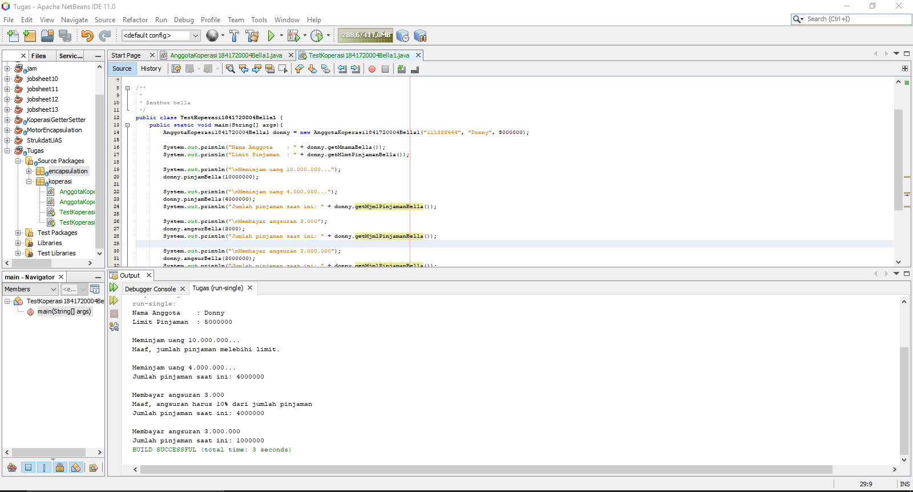

    Potongan program yang dimodifikasi pada method angsuranBella():
        int persen = mjmlPinjaman * 10 / 100;
        
        if(angsur > persen){
            mjmlPinjaman -= angsur;
        }
        else{
            System.out.println("Maaf, angsuran harus 10% dari jumlah pinjaman"); 
        }

    Link: [AnggotaKoperasi1841720004Bella1.java](../../src/3_Enkapsulasi/AnggotaKoperasi1841720004Bella1.java)

    Link: [TestKoperasi1841720004Bella1.java](../../src/3_Enkapsulasi/TestKoperasi1841720004Bella1.java) 

6. Modifikasi class TestKoperasi, agar jumlah pinjaman dan angsuran dapat menerima input dari console.

    **Jawaban:**

    Berikut adalah hasilnya:

    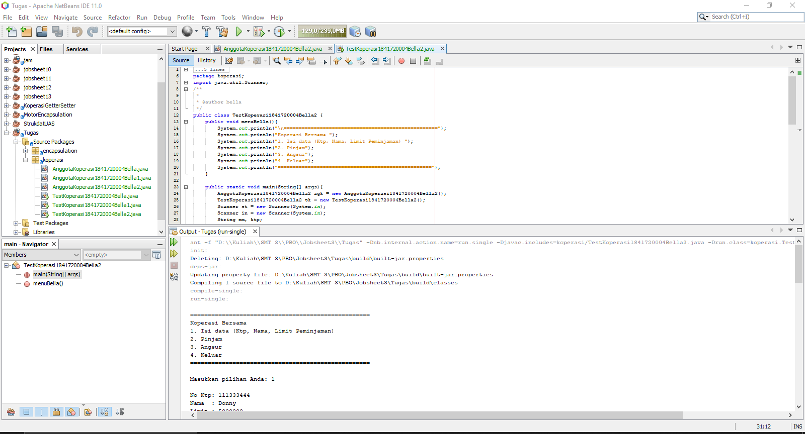

    Untuk lebih lengkapnya, program dapat dilihat di bawah ini:

    Link: [AnggotaKoperasi1841720004Bella2.java](../../src/3_Enkapsulasi/AnggotaKoperasi1841720004Bella1.java)

    Link: [TestKoperasi1841720004Bella2.java](../../src/3_Enkapsulasi/TestKoperasi1841720004Bella2.java)

## Kesimpulan

Dari percobaan diatas, telah dipelajari kosep dari enkapsulasi, kontruktor, access modifier yang
terdiri dari 4 jenis yaitu public, protected, default dan private. Konsep atribut atau method class
yang ada di dalam blok code class dan konsep instansiasi atribut atau method. Cara penggunaan
getter dan setter beserta fungsi dari getter dan setter. Dan juga telah dipelajari atau memahami
notasi UML

## Pernyataan Diri

Saya menyatakan isi tugas, kode program, dan laporan praktikum ini dibuat oleh saya sendiri. Saya tidak melakukan plagiasi, kecurangan, menyalin/menggandakan milik orang lain.

Jika saya melakukan plagiasi, kecurangan, atau melanggar hak kekayaan intelektual, saya siap untuk mendapat sanksi atau hukuman sesuai peraturan perundang-undangan yang berlaku.

Ttd,

_**(Bella Setyowati)**_
