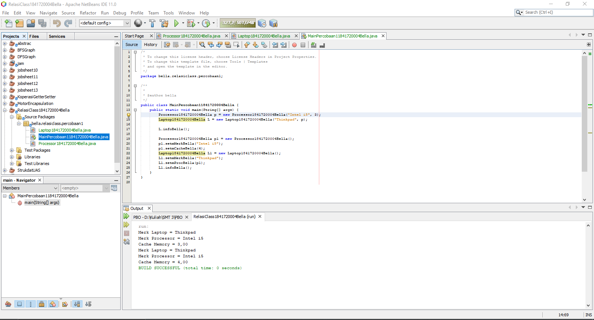
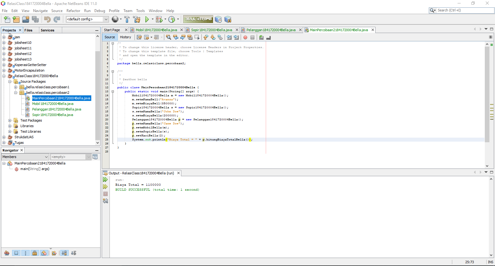
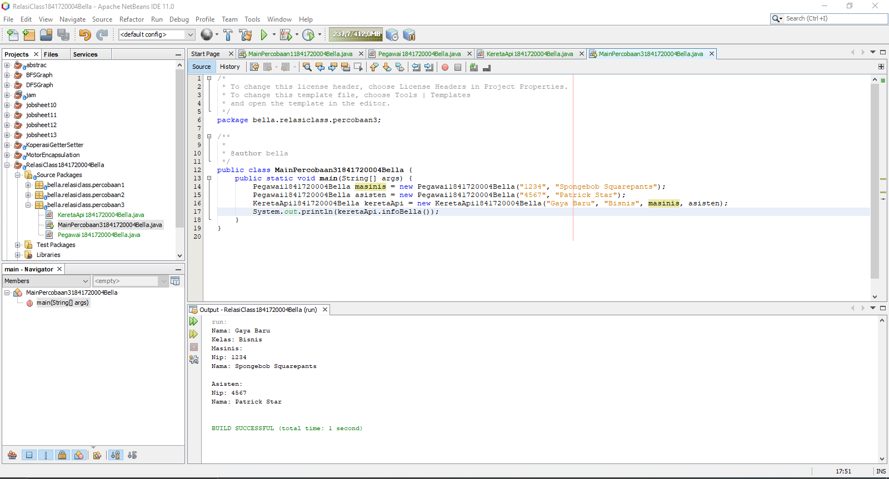
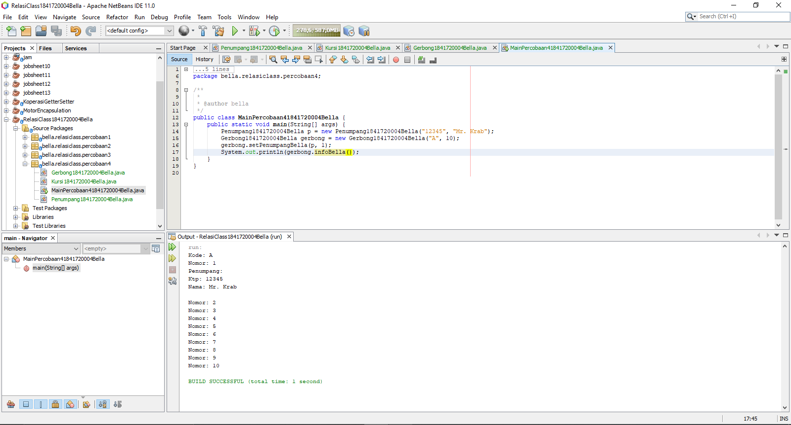
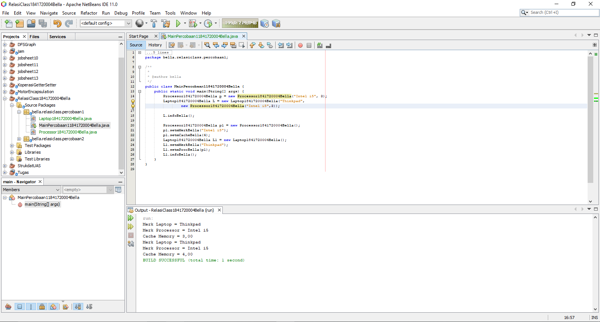
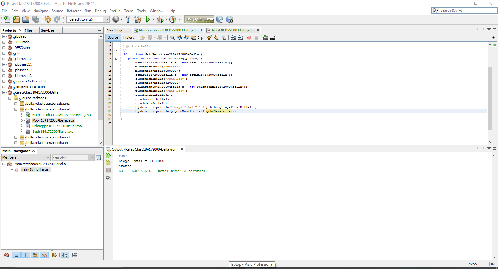
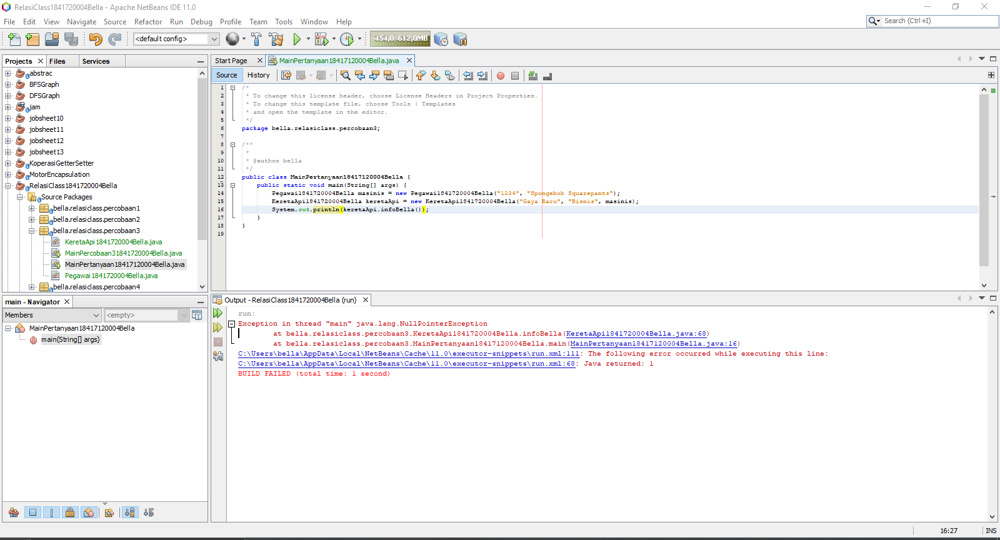
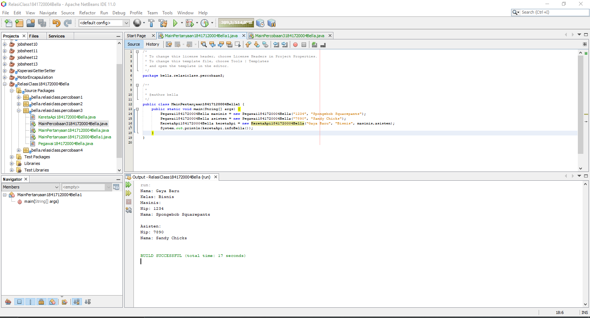
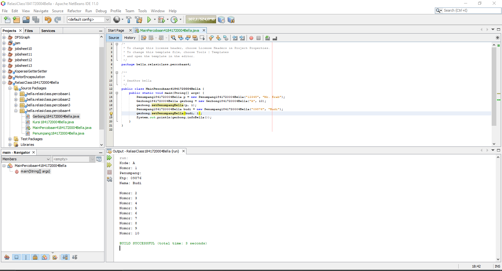
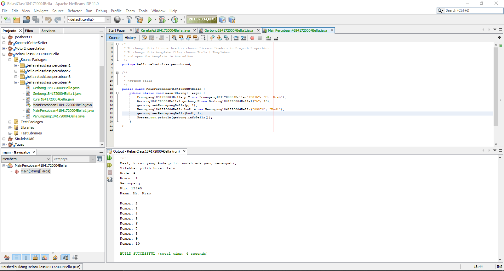

# Laporan Praktikum #4 - Relasi Class

## Kompetensi
Setelah menempuh pokok bahasan ini, mahasiswa mampu:
1. Memahami konsep relasi kelas;
2. Mengimplementasikan relasi has‑a dalam program.

## Ringkasan Materi
Contoh enkapsulasi: getter dan setter

## Percobaan

### Percobaan 1
Pada percobaan 1 ini, kita membuat sebuah class bernama Laptop1841720004Bella, MainPercobaan11841720004Bella dan Processor1841720004Bella. Yang dimana kedua class tersebut mempunyai relasi, dapat dilihat di bawah ini:

Berikut program yang sudah di buat:

Link: [Laptop1841720004Bella.java](../../src/4_Relasi_Class/Laptop1841720004Bella.java)

Link: [Processor1841720004Bella.java](../../src/4_Relasi_Class/Processor1841720004Bella.java)

Link: [MainPercobaan11841720004Bella.java](../../src/4_Relasi_Class/MainPercobaan11841720004Bella.java)

### Percobaan 2
Pada percobaan 2, kita membuat sebuah class Sopir1841720004Bella, Mobil1841720004Bella dan Pelanggan1841720004Bella dari class diagram di bawah ini, dan tidak lupa sebuah class MainPercobaan21841720004Bella sebagai class main-nya:

Berikut adalah hasil program yang telah di buat:

Link: [Sopir1841720004Bella.java](../../src/4_Relasi_Class/Sopir1841720004Bella.java)

Link: [Mobil1841720004Bella.java](../../src/4_Relasi_Class/Mobil1841720004Bella.java)

Link: [Pelanggan1841720004Bella.java](../../src/4_Relasi_Class/Pelanggan1841720004Bella.java)

Link: [MainPercobaan21841720004Bella.java](../../src/4_Relasi_Class/MainPercobaan21841720004Bella.java)

### Percobaan 3
Pada percobaan 3 ini, kita membuat sebuah class bernama Pegawai1841720004Bella dan KeretaApi1841720004Bella, tidak lupa juga membuat sebuah class main-nya yang bernama MainProgram1841720004Bella. Berikut adalah class diagram-nya:

Berikut adalah hasil programnya:

Link: [Pegawai1841720004Bella.java](../../src/4_Relasi_Class/Pegawai1841720004Bella.java)

Link: [KeretaApi1841720004Bella.java](../../src/4_Relasi_Class/KeretaApi1841720004Bella.java)

Link: [MainPercobaan31841720004Bella.java](../../src/4_Relasi_Class/MainPercobaan31841720004Bella.java)

### Percobaan 4
Pada percobaan 4 ini, kita membuat sebuah class bernama Penumpang1841720004Bella, Kursi1841720004Bella dan Gercong1841720004Bella. Tidak lupa membuat class main yang bernama MainPercobaan41841720004Bella. Berikut adalah UML class diagram dari  Penumpang1841720004Bella, Kursi1841720004Bella dan Gercong1841720004Bella:

Dan berikut adalah hasil dari program yang telah dibuat:

Link: [Penumpang1841720004Bella.java](../../src/4_Relasi_Class/Penumpang1841720004Bella.java)

Link: [Kursi1841720004Bella.java](../../src/4_Relasi_Class/Kursi1841720004Bella.java)

Link: [Gerbong1841720004Bella.java](../../src/4_Relasi_Class/Gerbong1841720004Bella.java)

Link: [MainPercobaan41841720004Bella.java](../../src/4_Relasi_Class/MainPercobaan41841720004Bella.java)

## Pertanyaan
1. Di dalam class Processor1841720004Bella dan class Laptop1841720004Bella , terdapat method setter dan getter untuk masing‑masing atributnya. Apakah gunanya method setter dan getter tersebut ?

    **Jawaban:**

    Setter digunakan untuk memberi nilai pada atribut di Enkapsulasi. Dan getter adalah mendapatkan nilai atribut.

2. Di dalam class Processor1841720004Bella dan class Laptop1841720004Bella, masing‑masing terdapat konstruktor default dan konstruktor berparameter. Bagaimanakah beda penggunaan dari kedua jenis konstruktor tersebut ?

    **Jawaban:**

    Pada konstruktor default, saat instansiasi object tidak perlu mengisi datanya secara langsung. Sedangkan yang berparameter membutuhkan data agar proses instansiasi object tidak error.

3. Perhatikan class Laptop1841720004Bella, di antara 2 atribut yang dimiliki (merk dan proc), atribut manakah yang bertipe object ?

    **Jawaban:**

    Yang merupakan atribut bertipe object adalah proc. Karena proc merupakan instansiasi dari class Processor1841720004Bella dan di gunakan untuk menghubungkan antara Laptop1841720004Bella dan Processor 1841720004Bella.

4. Perhatikan class Laptop1841720004Bella, pada baris manakah yang menunjukan bahwa class Laptop1841720004Bella memiliki relasi dengan class Processor1841720004Bella ?

    **Jawaban:**

    Pada baris public Laptop1841720004Bella(String mMerk, Processor1841720004Bella mProc) {...} (pembuatan konstruktor berparameter) dan pada baris private Processor1841720004Bella mProc;

5. Perhatikan pada class Laptop1841720004Bella , Apakah guna dari sintaks mProc.info() ?

    **Jawaban:**

    Digunakan untuk memanggil method info pada class Processor1841720004Bella.

6. Pada class MainPercobaan1, terdapat baris kode:

    Laptop l = new Laptop("Thinkpad", p);.

    Apakah p tersebut ?

    Dan apakah yang terjadi jika baris kode tersebut diubah menjadi:

    Laptop l = new Laptop("Thinkpad", new Processor("Intel i5",3));

    Bagaimanakah hasil program saat dijalankan, apakah ada perubahan ?

    **Jawaban:**

    p tersebut merupakan object dari Processor1841720004Bella yang sudah memiliki nilai.

    Hasil Program setelah dijalankan adalah seperti gambar di bawah ini:

    

    Lebih jelasnya sebagai berikut:

        Merk Laptop = Thinkpad
        Merk Processor = Intel i5
        Cache Memory = 3,00
        Merk Laptop = Thinkpad
        Merk Processor = Intel i5
        Cache Memory = 4,00

7. Perhatikan class Pelanggan1841720004Bella. Pada baris program manakah yang menunjukan bahwa class Pelanggan1841720004Bella memiliki relasi dengan class Mobil1841720004Bella dan class Sopir1841720004Bella ?

    **Jawaban:**

    Pada baris pembuatan atribut private Mobil1841720004Bella mMobil; dan private Sopir1841720004Bella mSopir; begitu juga pada getter dan setter nya.

8. Perhatikan method hitungBiayaSopir pada class Sopir1841720004Bella, serta method hitungBiayaMobil pada class Mobil1841720004Bella. Mengapa menurut Anda method tersebut harus memiliki argument hari ?

    **Jawaban:**

    Karena digunakan untuk mendapatkan biaya sopir yang dilakukan selama berapa hari ia melakukannya.

9. Perhatikan kode dari class Pelanggan1841720004Bella. Untuk apakah perintah mobil.hitungBiayaMobilBella(hari) dan sopir.hitungBiayaSopirBella(hari) ?

    **Jawaban:**

    Digunakan untuk memanggil sekaligus mengisi parameter pada method hitungBiayaMobilBella pada class Mobil1841720004Bella dan hitungBiayaSopirBella pada clas Sopir1841720004Bella

10. Perhatikan class MainPercobaan21841720004Bella. Untuk apakah sintaks p.setMobilBella(m) dan p.setSopirBella(s) ?

    **Jawaban:**

    Digunakan untuk memanggil sekaligus mengisi parameter di class Pelanggan1841720004Bella pada method setMobilBella dengan nilai object m dan dengan nilai object s.

11. Perhatikan class MainPercobaan21841720004Bella. Untuk apakah proses p.hitungBiayaTotalBella() tersebut ?

    **Jawaban:**

    Digunakan untuk memanggil method hitungBiayaTotalBella() pada class Pelanggan1841720004Bella dengan nama object p.

12. Perhatikan class MainPercobaan2, coba tambahkan pada baris terakhir dari method main dan amati perubahan saat di‑run!

    System.out.println(p.getmMobilBella().getmNamaBella());

    Jadi untuk apakah sintaks p.getmMobilBella().getmNamaBella() yang ada di dalam method main tersebut?

    **Jawaban:**

    Sintaks tersebut digunakan untuk mendapatkan nama/merk mobil di Pelanggan1841720004Bella

    Hasil dari program tersebut adalah

    

13. Di dalam method infoBella() pada class KeretaApi184172004Bella, baris this.masinis.infoBella() dan this.asisten.infoBella() digunakan untuk apa ?

    **Jawaban:**

    Digunakan untuk memanggil method infoBella() dari class Masinis1841720004Bella dengan object masinis, dan memanggil method infoBella dari class Pegawai1841720004Bella dengan nama object asisten.

14. Buatlah main program baru dengan nama class MainPertanyaan1841720004Bella pada package yang sama. Tambahkan kode berikut pada method main() !

        Pegawai1841720004Bella masinis = new Pegawai1841720004Bella("1234", "Spongebob Squarepants");
        KeretaApi1841720004Bella keretaApi = new KeretaApi1841720004Bella("Gaya Baru", "Bisnis", masinis); 
        System.out.println(keretaApi.infoBella()); 

    **Jawaban:**

    Program dapat dilihat [di sini](../../src/4_Relasi_Class/MainPertanyaan18417120004Bella.java).

15. Apa hasil output dari main program tersebut? Mengapa hal tersebut dapat terjadi ?

    **Jawaban:**

    Berikut adalah hasil outputnya:

    

    Hal itu terjadi karena tidak adanya object yang menghubungkan antara KeretaApi dengan Pegawai, maka diperlukan sebuah object asisten yang pada saat menginstansiasi object tersebut di-instansiasi dengan langsung memberinya sebuah nilai.

16. Perbaiki class KeretaApi sehingga program dapat berjalan !

    **Jawaban:**

    Program telah di-benarkan sebagai berikut:

        Pegawai1841720004Bella asisten = new Pegawai1841720004Bella("7890", "Sandy Chicks");
        KeretaApi1841720004Bella keretaApi = new KeretaApi1841720004Bella("Gaya Baru", "Bisnis", masinis,asisten);

    Hasil program setelah di run:

    

    Program dapat dilihat lebih lengkap [di sini](../../src/4_Relasi_Class/MainPertanyaan18417120004Bella1.java).

17. Pada main program dalam class MainPercobaan41841720004Bella, berapakah jumlah kursi dalam Gerbong A ?

    **Jawaban:**

    Ada 10.

18. Perhatikan potongan kode pada method infoBella() dalam class Kursi18417120004Bella. Apa maksud kode tersebut ?

        ...
        if (this.penumpang != null) {
            info += "Penumpang: " + penumpang.infoBella() + "\n";
        }
        ...

    **Jawaban:**

    Ketika penumpang tidak bernilai null, maka akan menampilkan info Penumpang / data diri penumpang.

19. Mengapa pada method setPenumpangBella() dalam class Gerbong18417120004Bella, nilai nomor dikurangi dengan angka 1 ?

    **Jawaban:**

    Digunakan untuk mengetahui jumlah kursi yang kosong / kursi yang tidak diduduki oleh penumpang.

20. Instansiasi objek baru budi dengan tipe Penumpang, kemudian masukkan objek baru tersebut pada gerbong dengan gerbong.setPenumpang(budi, 1). Apakah yang terjadi ?

    **Jawaban:**

    Yang terjadi adalah, data penumpang yang sudah terisi akan tergantikan dengan data budi yang baru. Berikut adalah gambar dari hasil program tersebut:

    

21. Modifikasi program sehingga tidak diperkenankan untuk menduduki kursi yang sudah ada penumpang lain !

    **Jawaban:**

    Berikut adalah hasil program yangn  telah dimodifikasi:

    

    Untuk class nya, saya meng-copy Gerbong1841720004Bella dengan nama baru yaitu Gerbong1841720004Bella1, untuk class lain tidak saya ganti / copy karena tidak ada modifikasi yang saya kasih. Yang saya modifikasi berada di method setPenumpangBella().

    Link: [Gerbong1841720004Bella1.java](../../src/4_Relasi_Class/Gerbong1841720004Bella1.java)

## Tugas

## Kesimpulan

Dari percobaan diatas, telah dipelajari bahwa suatu class dapat memiliki suatu hubungan atau relasi (has-a). Relasi antar kelas lain disebut dependensi (use-a) dan inheritance (is-a).

## Pernyataan Diri

Saya menyatakan isi tugas, kode program, dan laporan praktikum ini dibuat oleh saya sendiri. Saya tidak melakukan plagiasi, kecurangan, menyalin/menggandakan milik orang lain.

Jika saya melakukan plagiasi, kecurangan, atau melanggar hak kekayaan intelektual, saya siap untuk mendapat sanksi atau hukuman sesuai peraturan perundang-undangan yang berlaku.

Ttd,

_**(Bella Setyowati)**_