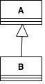
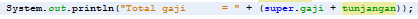

# Laporan Praktikum #6 - Inheritance

## Kompetensi
1. Memahami konsep dasar inheritance atau pewarisan.
2. Mampu membuat suatu subclass dari suatu superclass tertentu.
3. Mampu mengimplementasikan konsep single dan multilevel inheritance.
4. Mampu membuat objek dari suatu subclass dan melakukan pengaksesan terhadap atribut dan method baik yang dimiliki sendiri atau turunan dari superclass nya.

## Ringkasan Materi
Inheritance (turunan) merupakan cara unutk menurunkan sebuah class lebih umum menjadi class yanng lebih spesifik. Setiap sub class (anak) akan mewarisi sifat dari superclass (parent) selama bersifat protected dan public.

Cara mendeklarasikan sub class yaitu dengan menggunakan kata kunci extends setelah deklarasi nama class, kemudian diikuti dengan nama class parent-nya.

Terdapat 3 bentuk inheritance:
1. Single Inheritance = suatu class yang hanya memiliki satu parent class

    

2. Multilevel Inheritance = merupakan subclass yang menjadi superclass bagi class lain.

    

3. Multiple Inheritance: merupakan sebuah class dapat mewarisi properti dari lebih dari satu parent Class.

    

    (source: [Java and Multiple Inheritance](https://www.geeksforgeeks.org/java-and-multiple-inheritance/))

Pada java, kontrol pengaksesan dapat dilihat pada gambar berikut:

Kata kunci **super** dipakai untuk merujuk pada member dari parent class. Ketika membuat objek dari subclass, pada saat itu juga objek pada superclass juga akan terbentuk. 

## Percobaan

### Percobaan 1 (Extends)
Pada percobaan 1, kita membuat sebuah class bernama ClassA1841720004Bella, ClassB1841720004Bella dan juga class Percobaan11841720004Bella. ClassA1841720004Bella digunakan sebagai parent, class ClassB1841720004Bella digunakan sebagai class anak, dan juga class Percobaan11841720004Bella digunakan sebagai class main, yang dimana atribut untuk class parent dan anak menggunakan access modifier public. Berikut hasil programnya:

Link: [ClassA1841720004Bella.java](../../src/6_Inheritance/ClassA1841720004Bella.java)

Link: [ClassB1841720004Bella.java](../../src/6_Inheritance/ClassB1841720004Bella.java)

Link: [Percobaan11841720004Bella.java](../../src/6_Inheritance/Percobaan11841720004Bella.java)

**Hasil Pengamatan:**

Yang terjadi adalah terjadi error, karena pada ClassB1841720004Bella tidak menemukan variabel x.

### Percobaan 2 (Hak Akses)
Pada percobaan 2, kita membuat sebuah class bernama ClassA1841720004Bellaa, ClassB1841720004Bellaa dan juga class Percobaan21841720004Bellaa. ClassA1841720004Bellaa digunakan sebagai parent, class ClassB1841720004Bellaa digunakan sebagai class anak, dan juga class Percobaan21841720004Bellaa digunakan sebagai class main, yang dimana atribut untuk class parent dan anak menggunakan access modifier private. Berikut hasil programnya:

Link: [ClassA1841720004Bellaa.java](../../src/6_Inheritance/ClassA1841720004Bellaa.java)

Link: [ClassB1841720004Bellaa.java](../../src/6_Inheritance/ClassB1841720004Bellaa.java)

Link: [Percobaan21841720004Bella.java](../../src/6_Inheritance/Percobaan21841720004Bella.java)

**Hasil pengamatan:**

Terjadi error karena sumber code yang tidak dapat dikompilasi pada class ClassB1841720004Bellaa.

### Percobaan 3 (Super)
Pada percobaan 3, kita membuat sebuah class Bangun1841720004Bella (parent), class Tabung1841720004Bella (anak) dan juga class Percobaan31841720004Bella (main). Pada percobaan kali ini kita menggunakan acces modifier protected untuk atribut pada class parent dan anak. Berikut adalah hasil programnya:

Link: [Bangun1841720004Bella.java](../../src/6_Inheritance/Bangun1841720004Bella.java)

Link: [Tabung1841720004Bella.java](../../src/6_Inheritance/Tabung1841720004Bella.java)

Link: [Percobaan31841720004Bella.java](../../src/6_Inheritance/Percobaan31841720004Bella.java)

### Percobaan 4 (Super Contsructor)
Pada percobaan 4, kita membuat sebuah class ClassA1841720004Bellas (grantparent), class ClassB1841720004Bellas (parent), class ClassC1841720004Bellas (anak) dan juga class Percobaan41841720004Bella (main). Berikut adalah hasil programnya:

Link: [ClassA1841720004Bellas.java](../../src/6_Inheritance/ClassA1841720004Bellas.java)

Link: [ClassB1841720004Bellas.java](../../src/6_Inheritance/ClassB1841720004Bellas.java)

Link: [ClassC1841720004Bellas.java](../../src/6_Inheritance/ClassC1841720004Bellas.java)

Link: [Percobaan41841720004Bella.java](../../src/6_Inheritance/Percobaan41841720004Bella.java)

### Percobaan 5
Pada percobaan 5, kita menbuat sebuah class Karyawan1841720004Bella (parent), class Manajer1841720004Bella (anak), class Staff1841720004Bella (anak) dan juga class Inheritance11841720004Bella (main) Dari class diagram berikut:

Berikut hasil programnya:

Link: [Karyawan1841720004Bella.java](../../src/6_Inheritance/Karyawan1841720004Bella.java)

Link: [Manajer1841720004Bella.java](../../src/6_Inheritance/Manajer1841720004Bella.java)

Link: [Staff1841720004Bella.java](../../src/6_Inheritance/Staff1841720004Bella.java)

Link: [Inheritance11841720004Bella.java](../../src/6_Inheritance/Inheritance11841720004Bella.java)

### Percobaan 6
Pada percobaan 6, kita membuat sebuah class tambahan bernama StaffTetap1841720004Bellas dan StaffHarian1841720004Bellas yang dimana merupakan tambahan dari percobaan ke 5, yang dimana terdapat perubahan pada class Inheritance11841720004Bella yang sudah beri nama baru yaitu Inheritance11841720004Bellas. Berikut adalah gambar dari Class Diagramnya:

Berikut adalah hasil program yang sudah dijalankan:

Link: [Karyawan1841720004Bellas.java](../../src/6_Inheritance/Karyawan1841720004Bellas.java)

Link: [Manajer1841720004Bellas.java](../../src/6_Inheritance/Manajer1841720004Bellas.java)

Link: [Staff1841720004Bellas.java](../../src/6_Inheritance/Staff1841720004Bellas.java)

Link: [StaffTetap1841720004Bellas.java](../../src/6_Inheritance/StaffTetap1841720004Bellas.java)

Link: [StaffHarian1841720004Bellas.java](../../src/6_Inheritance/StaffHarian1841720004Bellas.java)

Link: [Inheritance11841720004Bellas.java](../../src/6_Inheritance/Inheritance11841720004Bellas.java)

## Pertanyaan
1.	Pada percobaan 1 diatas program yang dijalankan terjadi error, kemudian perbaiki sehingga program tersebut bisa dijalankan dan tidak error!

    **Jawaban:**

    Program yang saya betulkan berada pada class ClassB1841720004Bella yang sudah saya copy dan saya beri nama baru yaitu ClassB1841720004Bella1. Yang saya tambahkan adalah extends ClassA1841720004Bella. Berikut adalah hasil program percobaan 1 yang sudah di betulkan:

    

    Link: [ClassB1841720004Bella1.java](../../src/6_Inheritance/ClassB1841720004Bella1.java)

2. Jelaskan apa penyebab program pada percobaan 1 ketika dijalankan terdapat error!

    **Jawaban:**

    Terjadi error karena pada class anak (ClassB1841720004Bella) tidak melakukan extends terhadap class parent (ClassB1841720004Bella), sehingga pada anak tidak bisa mengakses class parent.

3. Pada percobaan 2 diatas program yang dijalankan terjadi error, kemudian perbaiki sehingga program tersebut bisa dijalankan dan tidak error!

    **Jawaban:**
    
    Dikarenakan atributnya private pada class parent, maka saya tambahkan Getter akan bisa mendapatkan nilai atribut mX dan mY, dan pada class anak saya tambahkan extends ClassA1841720004Bellaa. Untuk memudahan membedakan antara class parent dan anak yang ada pada percobaan dan pertayaan, saya beri nama baru ClassA1841720004Bellaa1 (parent) dan ClassB1841720004Bellaa1 (anak) Berikut adalah hasil program yang sudah saya perbaiki:

    

    Link: [ClassA1841720004Bellaa1.java](../../src/6_Inheritance/ClassA1841720004Bellaa1.java)

    Link: [ClassB1841720004Bellaa1.java](../../src/6_Inheritance/ClassB1841720004Bellaa1.java)

4.	Jelaskan apa penyebab program pada percobaan 1 ketika dijalankan terdapat error!

    **Jawaban:**

    Terjadi error karena sumber code yang tidak dapat dikompilasi pada class ClassB1841720004Bellaa dan tidak bisa membaca atribut mX dan mY.

5. Jelaskan fungsi “super” pada potongan program berikut di class Tabung1841720004Bella!

    

    **Jawaban:**

    Fungsi super di sini digunakan untuk mengakses atribut mPhi dan mR pada class parent.

6. Jelaskan fungsi “super” dan “this” pada potongan program berikut di class Tabung1841720004Bella!

    

    **Jawaban:**

    Fungsi super di sini digunakan untuk mengakses atribut mPhi dan mR, sedangkan this digunakan untuk mengakses atribut pada class Tabung1841720004Bella dan menekankan bahwa mT merupakan atribut pada class ini, bukan sebagai inputan dari user.

7. Pada percobaan 4 sebutkan mana class yang termasuk superclass dan subclass, kemudian jelaskan alasannya!

    **Jawaban:**

    Yang menjadi superclass adalah ClassA1841720004Bellas terhadap class ClassB1841720004Bella, dan ClassB1841720004Bella menjadi superclass terhadap class ClassC1841720004Bella. 
    > Mengapa demikian? 
    
    Karena class ClassA1841720004Bella mempunyai anak bernama ClassB1841720004Bella dan class ClassB1841720004Bella mempunyai anak ClassC1841720004Bella.

    Sedangkan yang menjadi subclass adalah ClassB1841720004Bella dan ClassC1841720004Bella. 
    
    > Mengapa demikian?

    Karena ClassB1841720004Bella merupakan turunan dari ClassA1841720004Bella dan class ClassC1841720004Bella merupakan turunan dari class ClassB1841720004Bella.

8. Ubahlah isi konstruktor default ClassC seperti berikut:

    

    Tambahkan kata super() di baris Pertaman dalam konstruktor defaultnya. Coba jalankan kembali class Percobaan4 dan terlihat tidak ada perbedaan dari hasil outputnya!

    **Jawaban:**

    Setelah di jalankan kembali tidak ada perubahan yang nampak.

9. Ublah isi konstruktor default ClassC seperti berikut:

    

    Ketika mengubah posisi super() dibaris kedua dalam kontruktor defaultnya dan terlihat ada error. Kemudian kembalikan super() kebaris pertama seperti sebelumnya, maka errornya akan hilang.

    Perhatikan hasil keluaran ketika class Percobaan4 dijalankan. Kenapa bisa tampil output seperti berikut pada saat instansiasi objek test dari class ClassC

    

    Jelaskan bagaimana urutan proses jalannya konstruktor saat objek test dibuat!

    **Jawaban:**

    Ketika objek test dibuat, maka object dari superclass-nya (ClassB1841720004Bella) akan terbentuk juga, hal ini berlaku juga untuk superclass ClassA1841720004Bella ketika objek class ClassB1841720004Bella dibuat. Dan ketikan konstruktor ClassC1841720004Bella dijalankan untuk membuat object, saat itu juga superclass akan berjalan. Sebelum subclass menjalankan konstruktornya sendiri, subclass akan menjalankan konstruktor superclass terlebi dahulu.

10.	Apakah fungsi super() pada potongan program dibawah ini di ClassC!

    

    **Jawaban:**

    Fungsi super() digunakan untuk merujuk class parent nya.

11. Sebutkan class mana yang termasuk super class dan sub class dari percobaan 1 diatas!

    **Jawaban:**

    Super class: ClassA1841720004Bella.

    Sub class: ClassB1841720004Bella.

12.	Kata kunci apakah yang digunakan untuk menurunkan suatu class ke class yang lain?

    **Jawaban:**

    Menggunakan kata kunci extends.

13.	Perhatikan kode program pada class Manager1841720004Bella, atribut apa saja yang dimiliki oleh class tersebut? Sebutkan atribut mana saja yang diwarisi dari class Karyawan1841720004Bella!

    **Jawaban:**

    Pada class Manager1841720004Bella memiliki atribut tunjangan yang bertipe integer.

    Atribut yang diwarisi dari class Karyawan1841720004Bella adalah atribut gaji.

14.	Jelaskan kata kunci super pada potongan program dibawah ini yang terdapat pada class Manager!

    

    **Jawaban:**

    Kata super di sini digunakan untuk menrujuk pada class parent yang dimana untuk mengakses atribut gaji pada class parent.

15.	Program pada percobaan 1 diatas termasuk dalam jenis inheritance apa? Jelaskan alasannya!

    **Jawaban:**

    Percobaan 1 termasuk dalam single inheritance, karena hanya memiliki 1 class parent (ClassA1841720004Bella).

16.	Berdasarkan class diatas (percobaan 6) manakah yang termasuk single inheritance dan mana yang termasuk multilevel inheritance?

    **Jawaban:**

    Yang termasuk single inheritance :
    - Manajer1841720004Bellas.

    Yang merupakan multilevel inheritance:
    - StaffTetap1841720004Bellas dan StaffHarian1841720004Bellas yang merupakan turunan dari Staff1841720004Bellas, dan class Staff1841720004Bellas merupakan turunan dari Karyawan1841720004Bellas. 

17.	Perhatikan kode program class StaffTetap1841720004Bellas dan StaffHarian1841720004Bellas, atribut apa saja yang dimiliki oleh class tersebut? Sebutkan atribut mana saja yang diwarisi dari class Staff1841720004Bellas!

    **Jawaban:**

    Atribut yang dimiliki StaffTetap1841720004Bellas:
    - golongan.
    - asuransi.

    Atribut yang dimiliki StaffHarian1841720004Bellas:
    - jmlJamKerja.

    Atribut warisan di class StaffTetap1841720004Bellas dan StaffHarian1841720004Bellas:
    - nama.
    - alamat.
    - jk.
    - umur.
    - gaji.
    - lembur.
    - potongan.

18.	Apakah fungsi potongan program berikut pada class StaffHarian

    

    **Jawaban:**

    Fungsi potongan program tersebut digunakan untuk meng-akses atribut nama, alamat, jk, umur, gaji, lembur dan potongan pada class Staff1841720004Bellas yang dimana class Staff1841720004Bellas sebagai class parent.

19.	Apakah fungsi potongan program berikut pada class StaffHarian

    

    **Jawaban:**

    Fungsi dari potongan program tersebut adalah untuk memanggil / meng-akses method bernama tampilDataStaffBella di class parent (Staff1841720004Bellas).

20.	Perhatikan kode program dibawah ini yang terdapat pada class StaffTetap

    

    Terlihat dipotongan program diatas atribut gaji, lembur dan potongan dapat diakses langsung. Kenapa hal ini bisa terjadi dan bagaimana class StaffTetap memiliki atribut gaji, lembur, dan potongan padahal dalam class tersebut tidak dideklarasikan atribut gaji, lembur, dan potongan?

    **Jawaban:**

    Karena atribut gaji, lembur dan potongan merupakan atribut parent (Staff1841720004Bellas), yang dimana class StaffTetap1841720004Bellas sudah meng-extends class Staff1841720004Bellas sehingga class StaffTetap1841720004Bellas dapat meng-akses/ memanggil atribut / method dari class Staff1841720004Bellas.

## Tugas
1.	Buatlah sebuah program dengan konsep pewarisan seperti pada class diagram berikut ini. Kemudian buatlah instansiasi objek untuk menampilkan data pada class Mac1841720004Bella, Windows1841720004Bella dan Pc1841720004Bella!.

    

    **Jawaban:**

    Berikut adalah hasil program yang sudah saya buat:

    

    Link: [Komputer1841720004Bella.java](../../src/6_Inheritance/Komputer1841720004Bella.java)

    Link: [Laptop1841720004Bella.java](../../src/6_Inheritance/Laptop1841720004Bella.java)

    Link: [Pc1841720004Bella.java](../../src/6_Inheritance/Pc1841720004Bella.java)

    Link: [Mac1841720004Bella.java](../../src/6_Inheritance/Mac1841720004Bella.java)

    Link: [Windows1841720004Bella.java](../../src/6_Inheritance/Windows1841720004Bella.java)

    Link: [MainTugas1841720004Bella.java](../../src/6_Inheritance/MainTugas1841720004Bella.java)

## Kesimpulan
Pada praktikum ini, kita membuat berbagai macam class. Yang dimana class tersebut mengimplementasikan single inheritance dan multilevel inheritance. Dan pada percobaan kali ini, kita belajar cara memanggil / meng-akses / merujuk ke class parent atau super class. Kita juga belajar mengenai perbedaan superclass dan subclass.

## Pernyataan Diri

Saya menyatakan isi tugas, kode program, dan laporan praktikum ini dibuat oleh saya sendiri. Saya tidak melakukan plagiasi, kecurangan, menyalin/menggandakan milik orang lain.

Jika saya melakukan plagiasi, kecurangan, atau melanggar hak kekayaan intelektual, saya siap untuk mendapat sanksi atau hukuman sesuai peraturan perundang-undangan yang berlaku.

Ttd,

_**(Bella Setyowati)**_