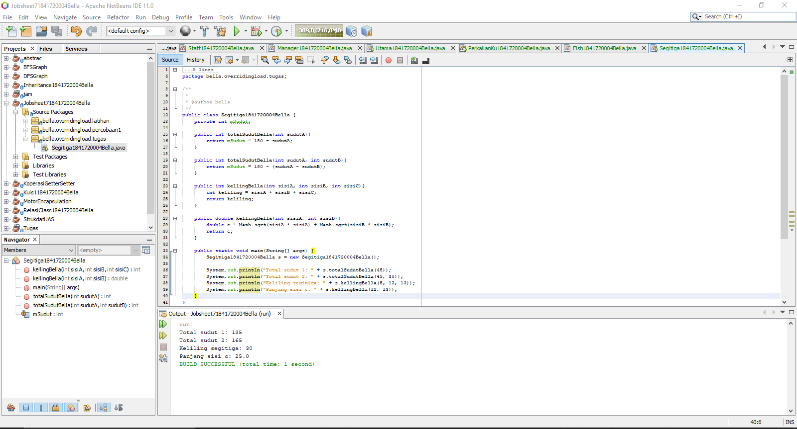

# Laporan Praktikum #7 - Overriding dan Overloading

## Kompetensi
Setelah menempuh pokok bahasan ini, mahasiswa mampu : 
1. Memahami konsep overloading dan overriding. 
2. Memahami perbedaan overloading dan overriding.
3. Ketepatan dalam mengidentifikasi method overriding dan overloading.
4. Ketepatan dalam mempraktekkan instruksi pada jobsheet.
5. Mengimplementasikan method overloading dan overriding.

## Ringkasan Materi
**Overloading**: Menuliskan kembali method dengan nama yang sama pada suatu class.

Aturan penulisan:
- Nama method harus sama.
- Daftar parameter harus berbeda.
- Return type boleh sama, juga boleh beda.

beberapa daftar parameter pada overloading:
- perbedaan daftar bukan hanya dari perbedaan banyaknya parameter, namun juga urutan dari parameter tersebut.
- daftar paramneter ridak terikat dengan penamaan variabel yang ada dalam parameter.

**Overriding**: subclass yang berusaha memodifikasi tingkah laku yang diwarisi dari superclass. Deklarasi method pada subclass harus sama dengan yang terdapat pada di super class. Letak kesamaan:
- Nama.
- Return type.
- Daftar parameter (jumlah, tipe dan urutan). 

Method pada parent class disebut **overridden** method dan method pada subclass
disebut **overriding** method. 

Aturan penulisan:
- Mode akses overriding harus sama atau lebih luas dari overriden method.
- Subclass hanya boleh meng-override method superclass satu kali.
- Overriding method tidak boleh throw checked exceptions yang tidak
dideklarasikan oleh overridden method.

**Method dynamic dispatch** merupakan salah satu **implementasi polymorphism** yang dimana overriden method **ditimpa** dan diselesaikan pada saat runtime. Objek dari superclass bisa di timpa dengan objek subclass, namun objek subclass tidak bisa ditimpa oleh objek superclass. Dan pada saat objek superclass sudah di timpa, maka yang akan muncul adalah method-method yang berada di class subclass.

## Percobaan
### Percobaan 1
Pada percobaan 1, kita menbua sebuah class Karyawan1841720004Bella (parent), Manager1841720004Bella (child), Staff1841720004Bella (child) dan juga class Utama1841720004Bella (main) yang dimana class anak memiliki method untuk menghitung gaji yang berbeda. Berikut adalah class diagram-nya:

Berikut adalah hasil dari percobaan 1:

Link: [Karyawan1841720004Bella.java](../../src/7_Overriding_dan_Overloading/Karyawan1841720004Bella.java)

Link: [Manager1841720004Bella.java](../../src/7_Overriding_dan_Overloading/Manager1841720004Bella.java)

Link: [Staff1841720004Bella.java](../../src/7_Overriding_dan_Overloading/Staff1841720004Bella.java)

Link: [Utama1841720004Bella.java](../../src/7_Overriding_dan_Overloading/Utama1841720004Bella.java)

## Latihan
Pada latihan ini, kita membuat sebuah class bernama PerkalianKu1841720004Bella yang dimana isi class tersebut memiliki dua method yang bernama sama namun jumlah parameter-nya berbeda. Berikut adalah hasil dari latihan:

Link: [PerkalianKu1841720004Bella.java](../../src/7_Overriding_dan_Overloading/PerkalianKu1841720004Bella.java)

## Pertanyaan
1. Dari source coding diatas (latihan) terletak dimanakah overloading?

    **Jawaban:**

    Terletak pada method perkalianBella yang dimana memiliki 3 parameter.

        void perkalianBella(int a, int b, int c){
            System.out.println(a * b * c);
        }

2. Jika terdapat overloading ada berapa jumlah parameter yang berbeda?

    **Jawaban:**

    Ada 1, yaitu int c. Untuk lebih jelasnya bisa dilihat di bawah ini:

        void perkalianBella(int a, int b){
            System.out.println(a * b);
        }
    
        //overloading
        void perkalianBella(int a, int b, int c){
            System.out.println(a * b * c);
        }

3. Dari source coding di bawah terletak dimanakah overloading?

    

    **Jawaban:**

    Yang merupakan overloading adalah method PerkalianBella yang kedua, dimana parameter untuk method tersebut bertipe double, sedangkan pada method PerkalianBella yang pertama bertipe integer.

4. Jika terdapat overloading ada berapa tipe parameter yang berbeda?

    **Jawaban:**

    Terdapat 2 tipe parameter yang berbeda (double a, double b).

5. Dari source coding di bawah terletak dimanakah overriding?

    

    **Jawabna:**

    Terletak pada method swimBella pada class Piranha1841720004Bella.

6. Jabarkanlah apabila source coding di atas jika terdapat overriding?

    **Jawaban:**

    Pada class Piranha1841720004Bella merupakan turunan dari class Ikan1841720004Bella yang mempunyai method swimBella. Dan pada class Piranha1841720004Bella juga mempunyai method swimBella yang merupakan overriding dari method swimBella di class Ikan1841720004ella.

## Tugas
1. Overloading

    Implementasikan konsep overloading pada class diagram di bawah ini :

    

    Berikut adalah hasil tugas overloading:

    

    Link: [Segitiga1841720004Bella.java](../../src/7_Overriding_dan_Overloading/Segitiga1841720004Bella.java)

2. Overriding

    Implementasikan class diagram dibawah ini dengan menggunakan teknik dynamic method dispatch :

    

    Berikut adalah hasil program dari tugas 2:

    

    Link: [Manusia1841720004Bella.java](../../src/7_Overriding_dan_Overloading/Manusia1841720004Bella.java)

    Link: [Dosen1841720004Bella.java](../../src/7_Overriding_dan_Overloading/Dosen1841720004Bella.java)

    Link: [Mahasiswa1841720004Bella.java](../../src/7_Overriding_dan_Overloading/Mahasiswa1841720004Bella.java)

    Link: [Main1841720004Bella.java](../../src/7_Overriding_dan_Overloading/Main1841720004Bella.java)

## Kesimpulan
Pada percobaan, latihan serta tugas kali ini, kita belajar mengenai overloading dan overriding. Overriding berlaku pada class inheritance sedangkan overloading berlaku pada semuanya.

Kita juga belajar perbedaan antara overriding dan overloading, cara atau aturan penulisan dari override dan overloading. Kita juga belajar mengenai dynamic method dispatch.

## Pernyataan Diri

Saya menyatakan isi tugas, kode program, dan laporan praktikum ini dibuat oleh saya sendiri. Saya tidak melakukan plagiasi, kecurangan, menyalin/menggandakan milik orang lain.

Jika saya melakukan plagiasi, kecurangan, atau melanggar hak kekayaan intelektual, saya siap untuk mendapat sanksi atau hukuman sesuai peraturan perundang-undangan yang berlaku.

Ttd,

_**(Bella Setyowati)**_