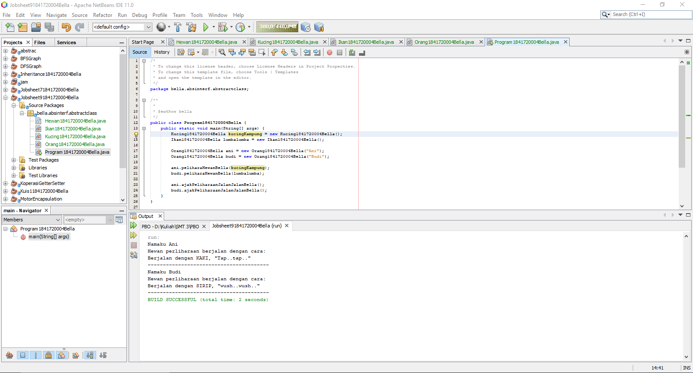
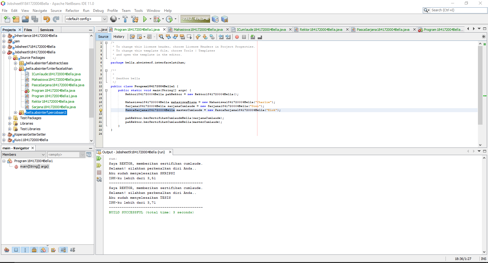
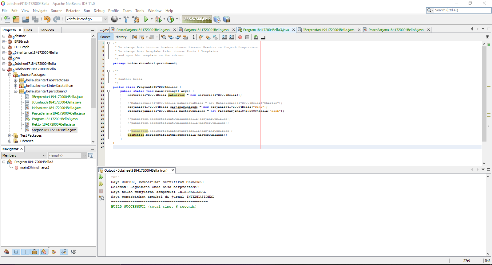
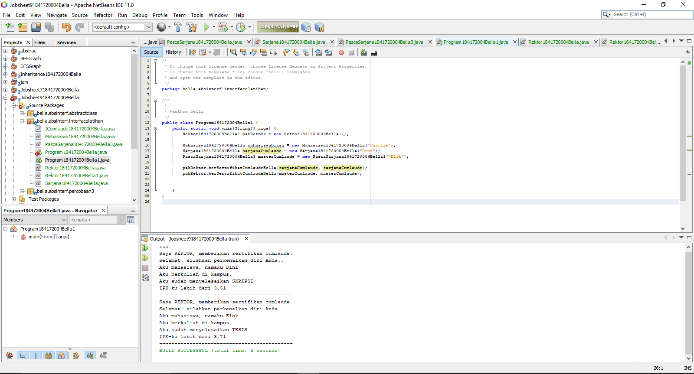
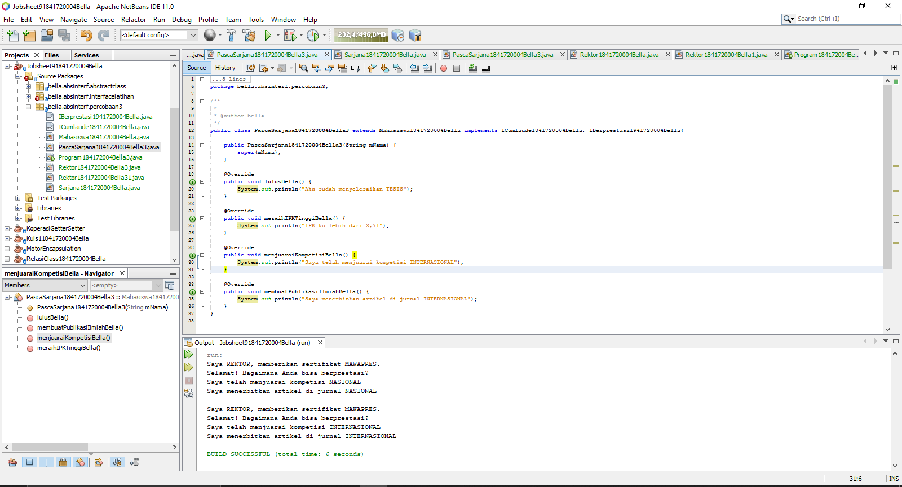
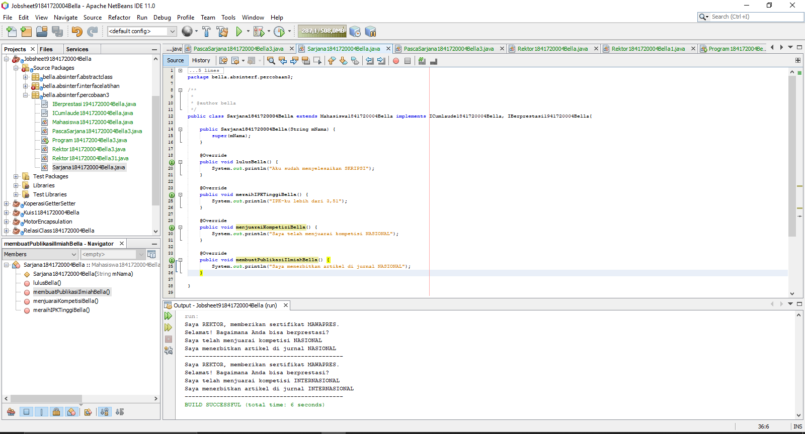
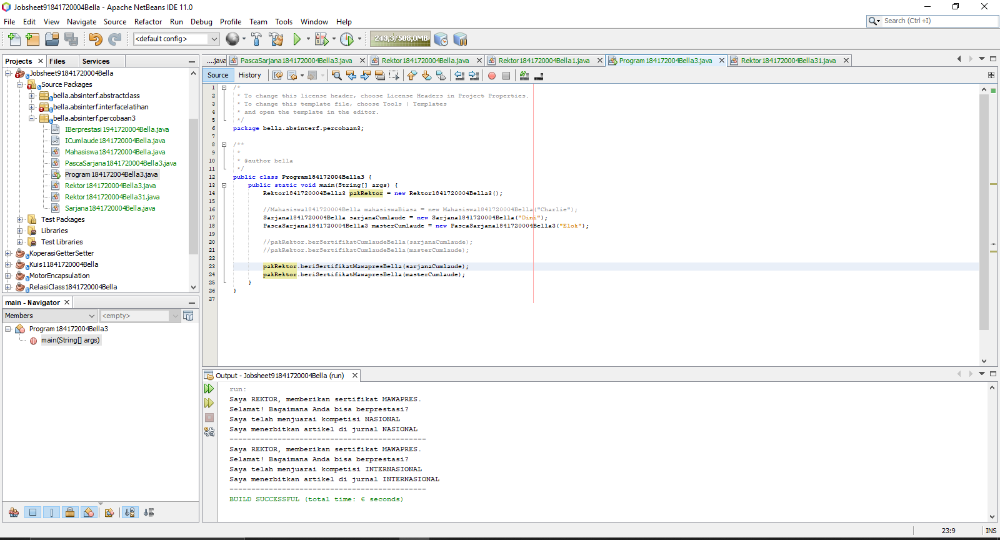

# Laporan Praktikum Abstract Class dan Interface

## Kompetensi
Setelah menyelesaikan lembar kerja ini mahasiswa diharapkan mampu:
1. Menjelaskan maksud dan tujuan penggunaan Abstract Class;
2. Menjelaskan maksud dan tujuan penggunaan Interface;
3. Menerapkan Abstract Class dan Interface di dalam pembuatan program.

## Ringkasan Materi
**Abstract** class adalah class yang tidak dapat diinstansisasi namun dapat di extend. Digunakan untuk menggambarkan yang bersifat umum, dan akan berfungsi setelah ia dideskripsikan ke dalam yang lebih spesifik.

**Karakteristik:**
- Dapat memiliki properties dan methods seperti class biasa.
- Selalu memiliki methods yang tidak memiliki tubuh (hanya deklarasinya saja), disebut juga abstract method.
- Selalu dideklarasikan dengan menggunakan kata kunci abstract class.

**Interface** adalah struktur data yang hanya bisa birisi abstract methods. 

**Karakteristik:**
- Tidak ada apa-apa di dalamnya selain abstract methods.
- Di konvensi bahasa pemrograman Java, namanya dianjurkan untuk selalu diawali dengan huruf
kapital ‘I’.
- Selalu dideklarasikan dengan menggunakan kata kunci interface.
- Diimplementasikan dengan menggunakan kata kunci implements.

## Percobaan

### Percobaan 1
Pada percobaan ini, kita membuat class Hewan1841720004Bella (abstract), class KucingHewan1841720004Bella (subclass HewanHewan1841720004Bella), IkanHewan1841720004Bella(sub class HewanHewan1841720004Bella), class OrangHewan1841720004Bella, dan juga class main bernama ProgramHewan1841720004Bella. Berikut adalah hasil dari program yang telah dibuat:

Link: [Hewan1841720004Bella.java](../../src/9_Abstract_Class_dan_Interface/Hewan1841720004Bella.java)

Link: [Kucing1841720004Bella.java](../../src/9_Abstract_Class_dan_Interface/Kucing1841720004Bella.java)

Link: [Ikan1841720004Bella.java](../../src/9_Abstract_Class_dan_Interface/Ikan1841720004Bella.java)

Link: [Orang1841720004Bella.java](../../src/9_Abstract_Class_dan_Interface/Orang1841720004Bella.java)

Link: [Program1841720004Bella.java](../../src/9_Abstract_Class_dan_Interface/Program1841720004Bella.java)

### Percobaan 2
Pada percobaan ini, kita membuat sebuah class bernama ICumlaude1841720004Bella, kemudian class Mahasiswa1841720004Bella, class Sarjana1841720004Bella, dan juga Sarjana1841720004Bella dan PascaSarjana1841720004Bella yang mengimplementasikan class ICumlaude1841720004Bella dan meng-extends Mahasiswa1841720004Bella, serta ada juga class Rektor1841720004Bella, tidak lupa class main yang bernama Program1841720004Bella. Pada percobaan ini class main masih error, berikut adalah hasil yang telah saya perbaiki:

Link: [ICumlaude1841720004Bella.java](../../src/9_Abstract_Class_dan_Interface/ICumlaude1841720004Bella.java)

Link: [Mahasiswa1841720004Bella.java](../../src/9_Abstract_Class_dan_Interface/Mahasiswa1841720004Bella.java)

Link: [Sarjana1841720004Bella.java](../../src/9_Abstract_Class_dan_Interface/Sarjana1841720004Bella.java)

Link: [PascaSarjana1841720004Bella.java](../../src/9_Abstract_Class_dan_Interface/PascaSarjana1841720004Bella.java)

Link: [Rektor1841720004Bella.java](../../src/9_Abstract_Class_dan_Interface/Rektor1841720004Bella.java)

Link: [Program184172004Bella1.java](../../src/9_Abstract_Class_dan_Interface/Program184172004Bella1.java)

Berikut script Program1841720004Bella yang belum diperbaiki:

Link: [Program184172004Bella.java](../../src/9_Abstract_Class_dan_Interface/Program184172004Bella.java)

### Percobaan 3
Pada percobaan ini, kita menambahkan class IBerprestasi1841720004Bella (interface) dan merubah class PascaSarjana1841720004Bella, class Rektor1841720004Bella dan class Program1841720004Bella. Berkut adalah hasil dari programnya:

Link: [IBerprestasi1841720004Bella.java](../../src/9_Abstract_Class_dan_Interface/IBerprestasi1841720004Bella.java)

Link: [PascaSarjana1841720004Bella3.java](../../src/9_Abstract_Class_dan_Interface/PascaSarjana1841720004Bella3.java)

Link: [Rektor1841720004Bella3.java](../../src/9_Abstract_Class_dan_Interface/Rektor1841720004Bella3.java)

Link: [Program184172004Bella3.java](../../src/9_Abstract_Class_dan_Interface/Program184172004Bella3.java)

## Pertanyaan
1. Bolehkah apabila sebuah class yang meng-extend suatu abstract class tidak
mengimplementasikan method abstract yang ada di class induknya? Buktikan!

    **Jawaban:**

    Tidak, karena jika tidak mengimplementasikan method abstract yang ada di class induknya akan terjadi error.

2. Kenapa terjadi error? Jelaskan!

    **Jawaban:**

    Karena class Mahasiswa1841720004Bella tidak di implement dengan ICumlaude1841720004Bella. 

3. Dapatkah method kuliahDiKampusBella() dipanggil dari objek sarjanaCumlaude di class Program1841720004Bella? Mengapa demikian?

    **Jawaban:**

    Bisa, karena class Sarjana1841720004Bella merupakan sub class dari Mahasiswa1841720004Bella, sehingga bisa di panggil.

4. Dapatkah method kuliahDiKampus() dipanggil dari parameter mahasiswa di method beriSertifikatCumlaudeBella() pada class Rektor? Mengapa demikian?

    **Jawaban:**

    Tidak bisa, karena class Rektor1841720004Bella tidak menjadi anak dari class Mahasiswa1841720004Bella, sehingga tidak bisa dipanggil / di akses.

5. Modifikasi Modifikasilah method beriSertifikatCumlaudeBella() pada class Rektor1841720004Bella.

    **Jawaban:**

    Berikut adalah Rektor1841720004Bella yang telah saya rubah: 

    [Rektor1841720004Bella1.java](../../src/9_Abstract_Class_dan_Interface/Rektor1841720004Bella1.java)

    Dan berikut adalah gambar class main dan hasilnya:

    

6. Apabila Sarjana Berprestasi harus menjuarai kompetisi NASIONAL dan menerbitkan
artikel di jurnal NASIONAL, maka modifikasilah class-class yang terkait pada aplikasi
Anda agar di class Program objek pakRektor dapat memberikan sertifikat mawapres pada objek sarjanaCumlaude.

    **Jawaban:**

    

    

    

## Kesimpulan
Pada praktikum kali ini, kita membuat sebuah macam-macam class class Abstract dan class Interface. Kita mempelajari perbedaan antara class Abstract dan class Interface. Kita juga mempelajari cara penulisan dari class abstract dan class interface.

## Pernyataan Diri

Saya menyatakan isi tugas, kode program, dan laporan praktikum ini dibuat oleh saya sendiri. Saya tidak melakukan plagiasi, kecurangan, menyalin/menggandakan milik orang lain.

Jika saya melakukan plagiasi, kecurangan, atau melanggar hak kekayaan intelektual, saya siap untuk mendapat sanksi atau hukuman sesuai peraturan perundang-undangan yang berlaku.

Ttd,

_**(Bella Setyowati)**_